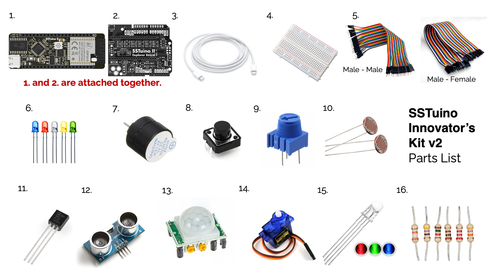

# SSTuino Innovator's Kit v2 Parts List

> **Note:** Please do not plug in the SSTuino II and/or its components to your learning device or any power source first. We will get to it very soon. :)

Upon recieving your SSTuino Innovator's Kit v2, please ensure that all the components are present as stated below:

| No. | Component Name                       | Quantity  |
|---- |:------------------------------------:| ---------:|
| 1   | SSTuino II                           | 1         |
| 2   | SSTuino II Explorer Board            | 1         |
| 3   | USB-C Cable                          | 1         |
| 4   | Breadboard                           | 1         |
| 5   | Dupont cables (wires) (M-M), (M-F)   | 1 Each    |
| 6   | Assortment of LEDs                   | 1 Bag     |
| 7   | Buzzer                               | 1         |
| 8   | Push Button                          | 2         |
| 9   | Potentiometer (10K Ohm)              | 1         |
| 10  | Light Dependent Resistor             | 1         |
| 11  | TMP36 Temperature Sensor             | 1         |
| 12  | Ultrasonic Sensor                    | 1         |
| 13  | PIR Proximity Sensor                 | 1         |
| 14  | Servo                                | 1         |
| 15  | RGB LED                              | 1         |
| 16  | 330Ohm and 10KOhm resistor reel      | 1 Bag     |

## Installation of prerequisites

Next, we will be installing essential software onto your learning device.

[Setting up your SSTuino II](../setup/index.md)
