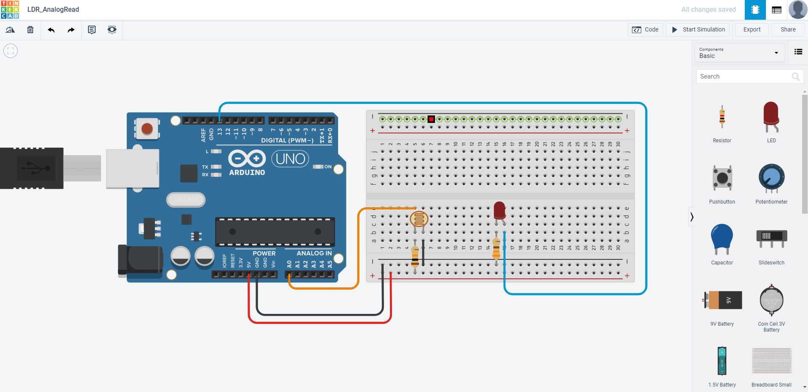
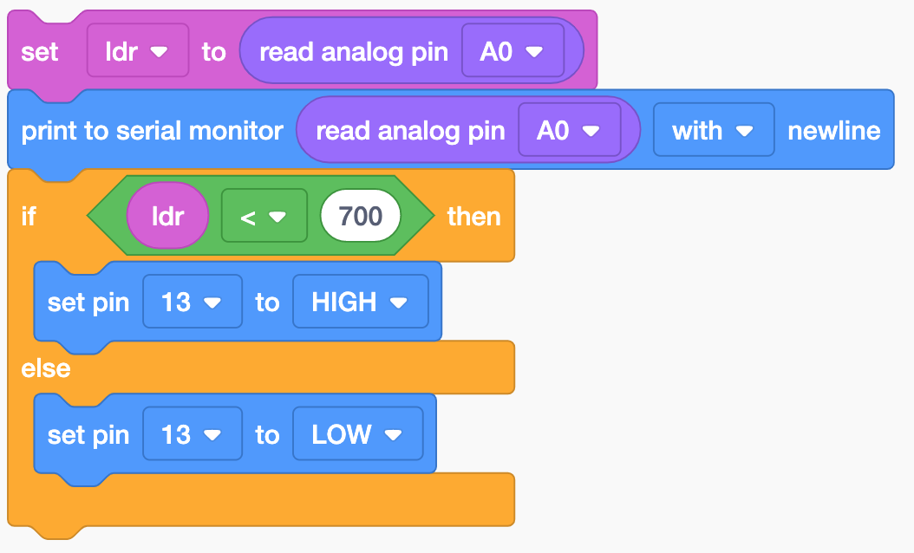
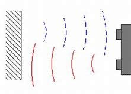
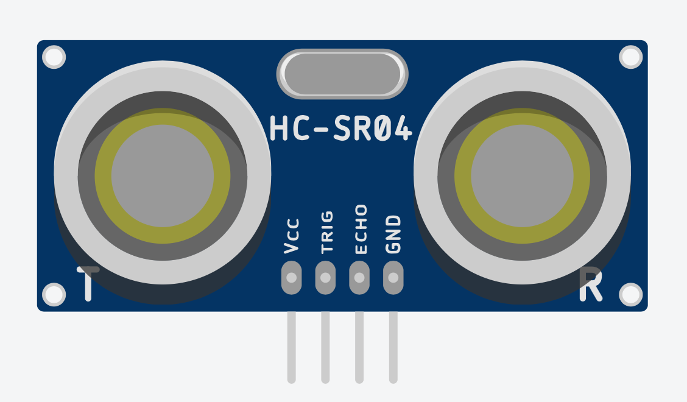
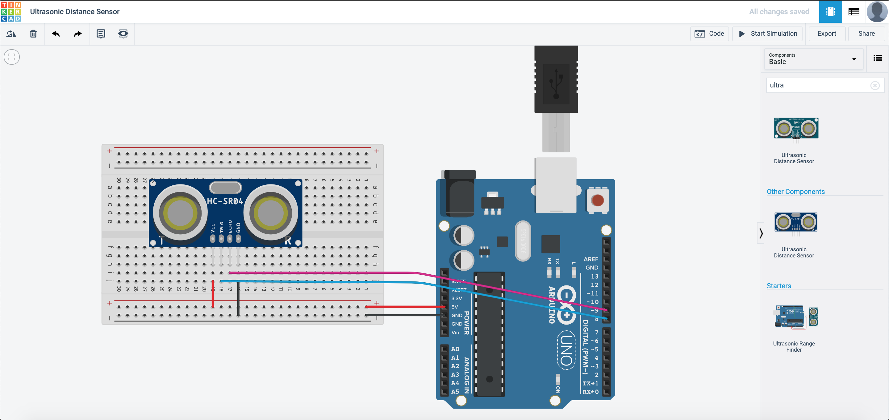
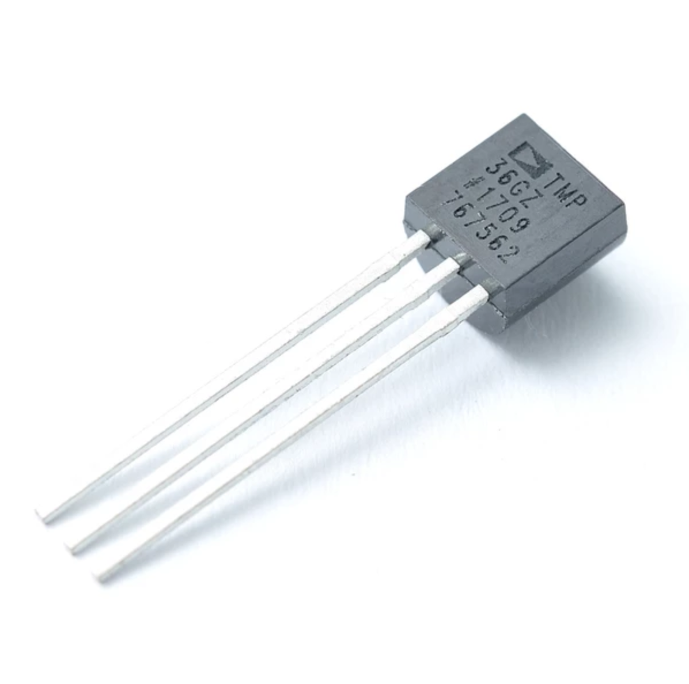
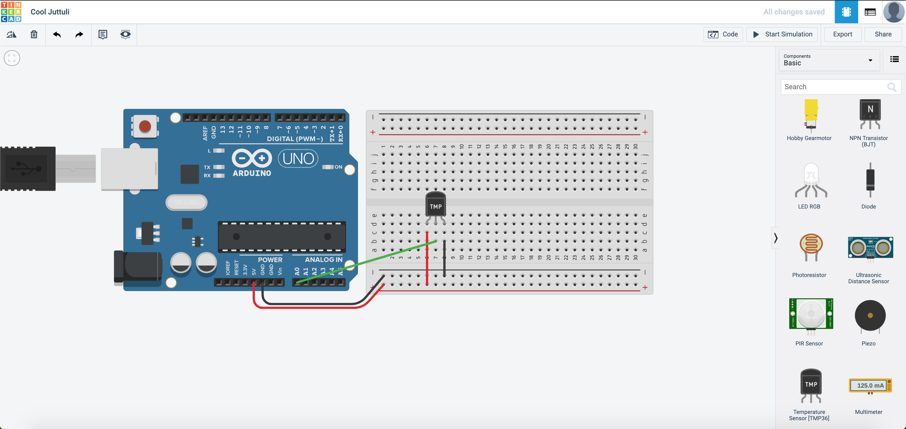
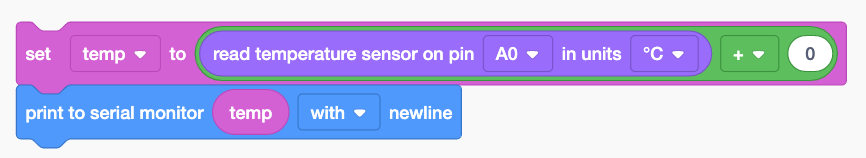

# More Analog Functions

{: .no_toc }

  

    Table of contents
  

  {: .text-delta }
1. TOC
{:toc}

For this exercise, we will be going back to the Light Dependant Resistor (LDR)/photoresistor. In the previous tutorial, we managed to try out the photoresistor. Now we are going to make use of it as an input for the SSTuino to trigger something! You may remember that the purpose of the photoresistor was not really significant or useful, as it made the LED brighter when the environment was bright. But with some programming, we can make it work properly!

Let us move into TinkerCAD and create a new circuit, something that looks like this:

We will read the photoresistor value from the analog pin and output it to the serial monitor.

When running the simulation, open up the serial monitor. The result should look something like this:

While I change the light intensity of the LDR, the readings also change.

Now let us make it useful. We would want to make it such that when the environment darkens, the LED will light up. To do so, we edit our code to something like this:

In the `if` statement, the value where your LDR detects that the environment is dark varies. You may have a different value for your circuit and you will need to edit the value.

## Ultrasonic Sensor

The ultrasonic distance sensor uses ultrasonic waves - a very high-pitched sound that we cannot hear to measure the distance it is from an object. It is in a **transducer** configuration, where the transmitter and receiver is on the same sensor.

One of the most common uses of ultrasonic distance sensor is in the automotive industry. They are usually used as reverse warning sensors but are increasingly used in self-driving vehicles, like Tesla's Autopilot for example.

The ultrasonic sensor we are going to use is the HC-SR04, which is commonly used in Arduino circuits:

> Note that we need to use the 4 pin sensor instead of the 3 pin one, which can be found by typing *ultrasonic sensor* in the component search bar.

Let us go into TinkerCAD and create a new circuit. We are going to assemble it like this:

The coding part with blocks is rather simple, as the TinkerCAD team have simplified the code to just this line:

## Temperature Sensor

Temperature sensors are essential in electronics. Their uses are very broad, ranging from reading the temperature of the surrounding environment, to the temperature probes on your computer, to keep it from overheating! The temperature sensor that we are going to use in this exercise is the TMP36, an affordable yet accurate temperature sensor.

Let us go into TinkerCAD and create a new circuit. We are going to assemble it like this:

The code will look something like this:

We declared a variable called `temp`, and we let the reading of the temperature sensor be the variable. Next, we add a `+` sign to it to calibrate the sensor. In the event the sensor reading is lower than the actual reading, we add a few degrees to bring it up.
