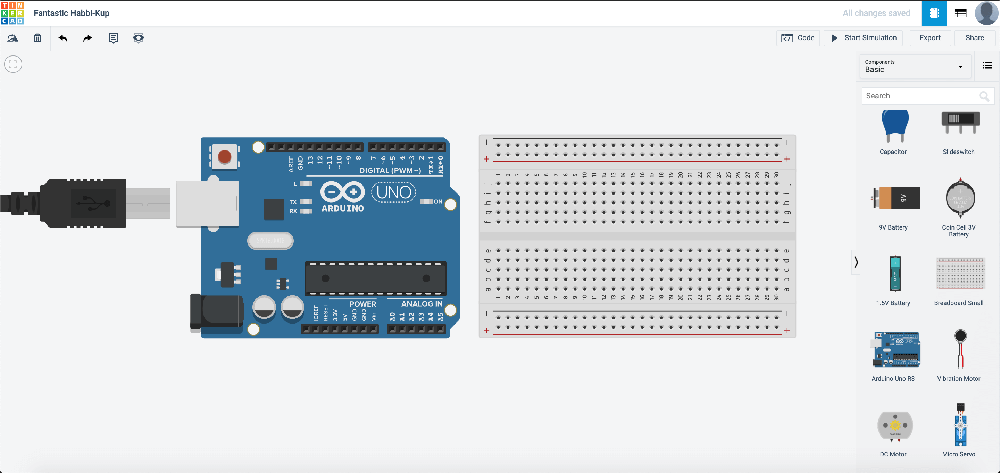
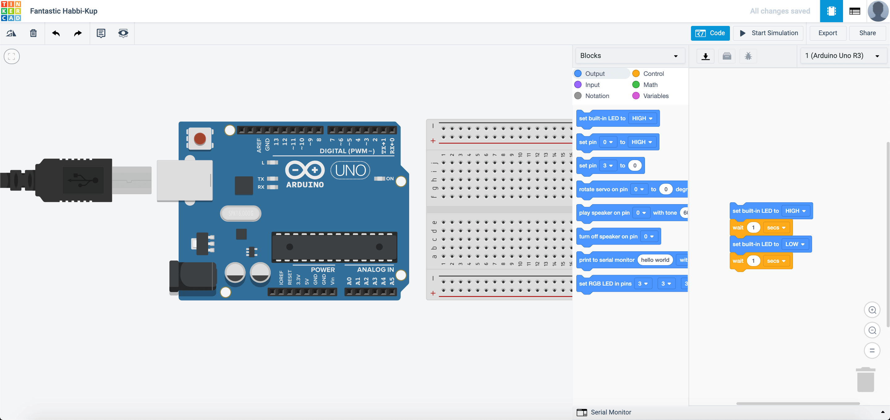
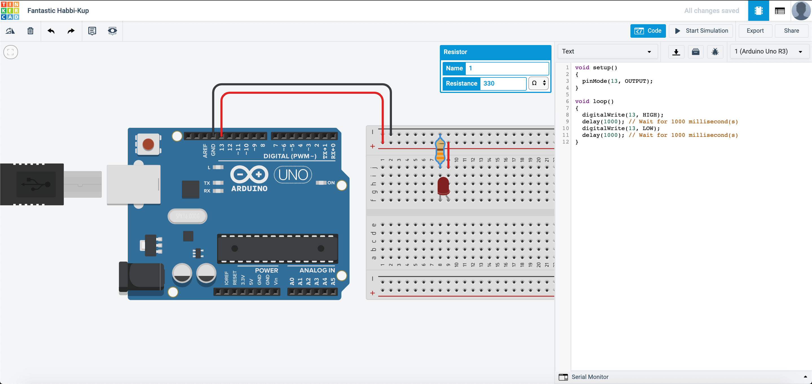
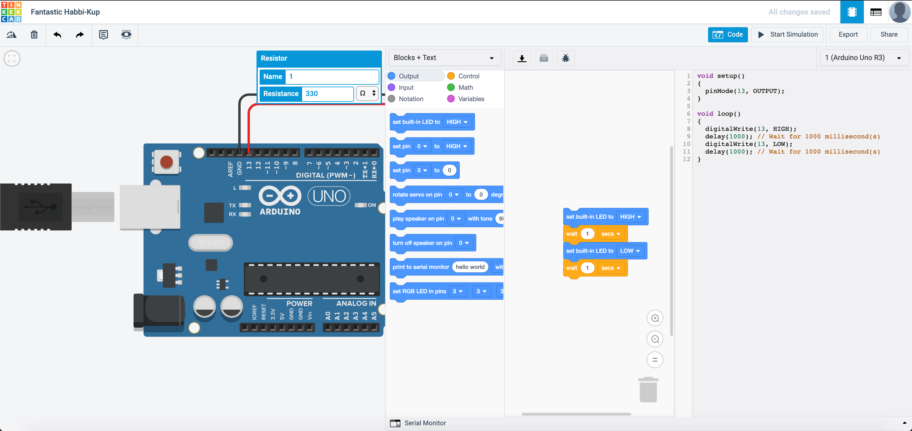
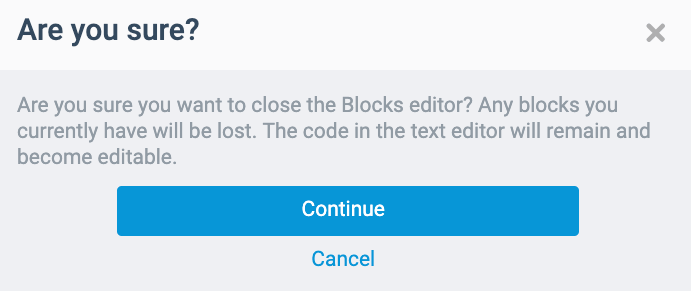
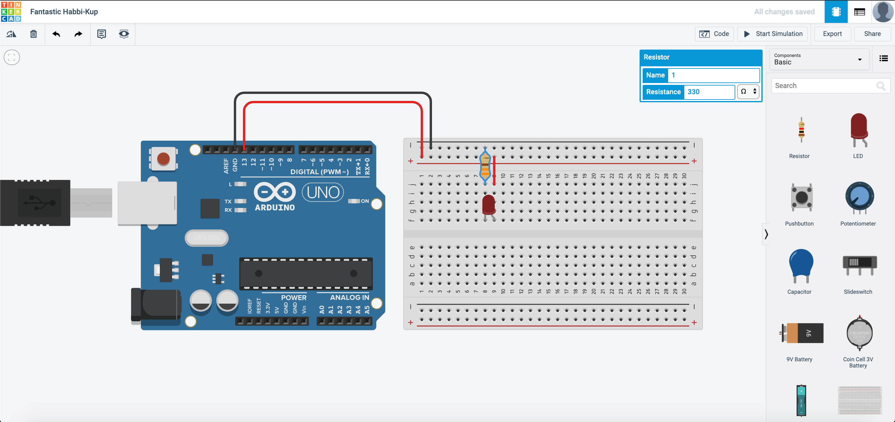
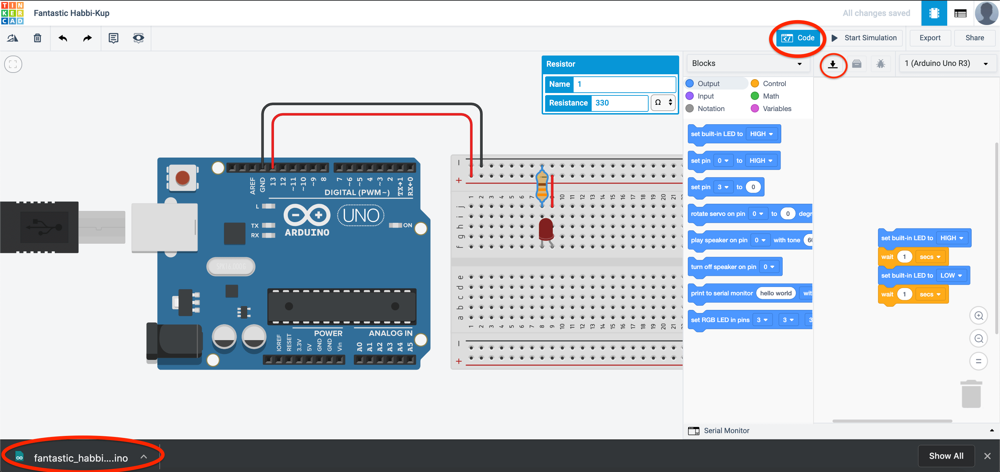
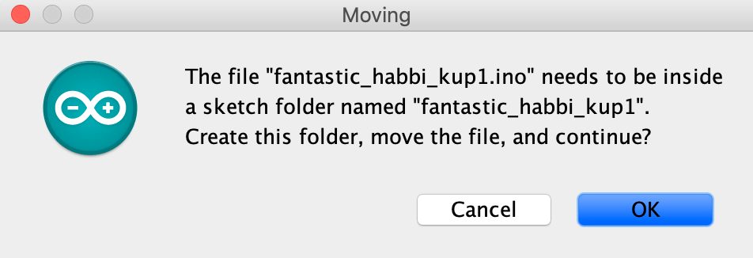
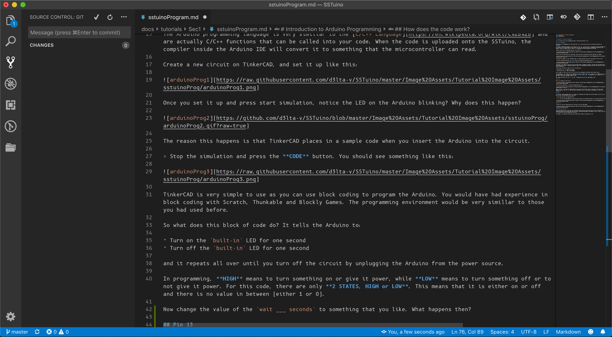

# Programming the SSTuino II

In this tutorial, we will discuss about the programming language that the SSTuino II uses, and explore some examples.

{: .no_toc }

<details open markdown="block">
  <summary>
    Table of contents
  </summary>
  {: .text-delta }
1. TOC
{:toc}
</details>

## Virtual Programming

Before we go into programming with the Arduino IDE, let us take things slow with the coding functionality on TinkerCAD!

The Arduino programming language is very similar to the [C/C++ Language](https://en.wikipedia.org/wiki/C%2B%2B) and are actually C/C++ functions that can be called into your code. When the code is uploaded onto the SSTuino, the compiler inside the Arduino IDE will convert it to something that the microcontroller can read.

For documentation regarding the Arduino IDE, please visit [this website](https://docs.arduino.cc/software/ide-v1/tutorials/arduino-ide-v1-basics).

Create a new circuit on TinkerCAD, and set it up like this:



Once you set it up and press start simulation, notice the LED on the Arduino blinking? Why does this happen?


The reason this happens is that TinkerCAD places in a sample code when you insert the Arduino into the circuit.

> Stop the simulation and press the **CODE** button. You should see something like this:



TinkerCAD is very simple to use as you can use block coding to program the Arduino, and might be familiar if you have done block coding before.

If you would like to program with text in TinkerCAD, you can also do so like this:



They also have another format called Blocks + Code. The text code changes according to the blocks that you place.



> **Note:** In TinkerCAD, when you program in blocks, the text that you coded will be deleted, and when you program in text, the blocks that you placed will be deleted when you change the programming mode. This is to prevent any internal application error with the website.

So what does this block of code do? It tells the Arduino to:

* Turn on the `built-in` LED for one second
* Turn off the `built-in` LED for one second

and it repeats all over until you turn off the circuit by unplugging the Arduino from the power source.

In programming, **HIGH** means to turn something on or give it power, while **LOW** means to turn something off or to not give it power. For this code, there are only **2 STATES, HIGH or LOW**. This means that it is either on or off and there is no value in between (either 1 or 0).

Now change the value of the `wait ___ seconds` to something that you like. What happens then?

## Pin 13

[Note for self: need to verify if pin13 is still used, due to the migration to the SSTuino II platform.]

Now, let us connect up the circuit:



After you start simulation, it should look something like this:


*Wait a minute...* How come the LED attached turns on and off even though I did not program it? Well the reason behind it is that the `built-in` LED pin is also connected to pin 13. This means in the program, `LED_BUILTIN` is also pin 13.

## Download program from TinkerCAD to Arduino IDE

In TinkerCAD, another awesome feature is the ability to download the program that you have coded just now! You just have to press the download button as shown here:

> Go to code, and press the download button



A `.ino` file will be downloaded on your LD and can be used on the Arduino IDE. Open the file and you would see this:



Click **OK**.

A folder will then be created, and you will be able to see this code appear.

## Your code in Arduino IDE


You would probably have noticed that this code looks rather different from the blocks you see in TinkerCAD. The Arduino app that you are using right now is called an **Integrated Development Environment** or **IDE** for short and is one of the programs that you can program your SSTuino II in.

For example, I use another IDE called Visual Studio Code to modify this website for you! (in [Markdown](https://en.wikipedia.org/wiki/Markdown))



Let us analyse the code we see here


Here is an explanation on how most basic Arduino code works:

```cpp
// These two slashes indicate a comment
/* This also indicates a comment 
The brackets () indicate a function e.g. int main()
*/
void setup() //This is only run once when the device first powers up.
{ //<- The curly brackets are very important. Place them carefully to avoid confusion.
    pinMode(13, OUTPUT); 
    /*
    Why is pinMode written as so? That is due to the practice of using camelCase for writing code.
    We declare pin 13 as the output pin. It can also be written as pinMode(LED_BUILTIN, OUTPUT).
    The state "OUTPUT" must be written in CAPITAL LETTERS.
    
    It is also very important to place a semicolon ";" when you finish your "sentence", just like
    how you write sentences in your essays.
    */
    
}

void loop() //loop = runs forever till the end of time (or until you turn off the power)
{
  digitalWrite(13, HIGH);// Turn on pin 13
  delay(1000); // Wait for 1000 millisecond(s)
  digitalWrite(13, LOW);// Turn off pin 13
  delay(1000); // Wait for 1000 millisecond(s)

  /* 
  The section above will turn on and off the LED. Note the CAPITAL LETTERS on the "HIGH" and "LOW"
  */
}
```

### Additional information

Learn more about camelCase here: [https://en.wikipedia.org/wiki/Camel_case](https://en.wikipedia.org/wiki/Camel_case)

Learn more about the "()" :[http://www.cplusplus.com/reference/functional/function/operator_func/](http://www.cplusplus.com/reference/functional/function/operator_func/)

If you want to read up about C++: [http://www.cplusplus.com/](http://www.cplusplus.com/)

Arduino language reference: [https://www.arduino.cc/reference/en/](https://www.arduino.cc/reference/en/)

## It WORKS!!!

[Need to do this up for the SSTuino II]

Now, let us connect our SSTuino like this:

>**NOTE:** To prevent damage to your computer or the components, please **do not connect the SSTuino II to your LD or any power supply** when you are wiring up your circuit!

Only connect the SSTuino to your LD after you have finished assembling the circuit.

In your Arduino IDE, go to

[Need to change the steps for the SSTuino II]

And now you can upload with this button:


You should see your circuit light up like this:

[Insert working circuit]
