# More Digital Functions

{: .no_toc }

<details open markdown="block">
  <summary>
    Table of contents
  </summary>
  {: .text-delta }
1. TOC
{:toc}
</details>

Let us discover more digital functions of the SSTuino II!

## Pull-up Resistors

Pull-up resistors are found in digital logic devices and microcontrollers. When a pin in say, the SSTuino is connected as an input and tries to read the state of the pin, it is very difficult to determine whether the pin is actually high or low, due to a lot of factors such as noise in the circuit. This effect is referred to as floating (more detailed explanation [here](https://learn.adafruit.com/circuit-playground-digital-input/floating-inputs)).

To eliminate this, we will place a pull-up resistor to ensure that the pin is either in its `high` or `low` state, while using a little bit of current. Pull-up resistors are usually used on buttons and switches where there is a possibility of signal noise.


If you would like to read more about this, visit this sparkfun guide here:

[https://learn.sparkfun.com/tutorials/pull-up-resistors/all](https://learn.sparkfun.com/tutorials/pull-up-resistors/all)

## Buttons

We are going to read very simple data from a push button, to know whether it has been pressed or not. Set up your circuit as shown:

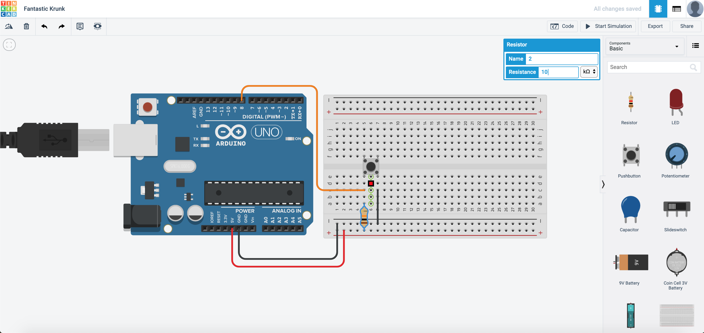

Next, go to the coding section and then program it like this:

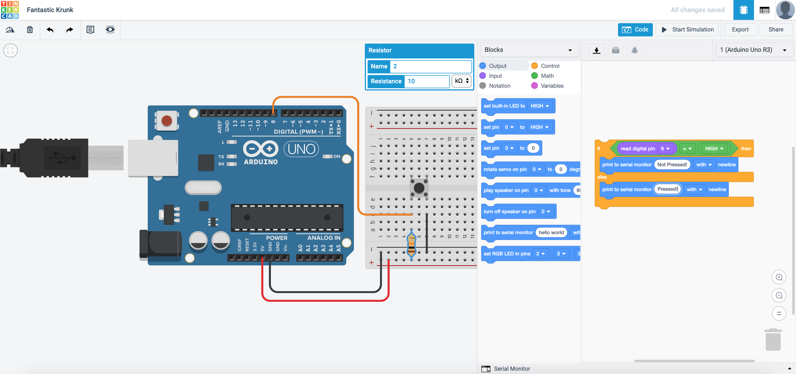

What this code does is that the Arduino would wait for the button to be pressed. If the button is not pressed, it would output "Not pressed!" in the serial monitor. If the button is pressed, it would output "pressed!" in the serial monitor.

Now start simulation and then press the serial monitor:
<p align="center">
  <video width="100%" autoplay muted loop controls>
    <source src="https://raw.githubusercontent.com/FourierIndustries-LLP/Knowledge-Base/main/docs/SSTuinoII/tutorials/sec1/digital/assets/arduinoButton3.mp4" type="video/mp4">
  Your browser does not support the video tag.
  </video>
</p>
Copy this circuit over to your SSTuino board setup.

>**NOTE:** To prevent damage to your computer or the components, please **do not connect the SSTuino II to your LD or any power supply** when you are wiring up your circuit! Please connect the SSTuino to your LD only after you have finished assembling the circuit.

## Control your lights

*This time with coding...* With the data we have read from the push button, we can use it to trigger a reaction! Set up your circuit as shown:


Next, we will need to edit the code such that the LED will light up when the button is pressed:

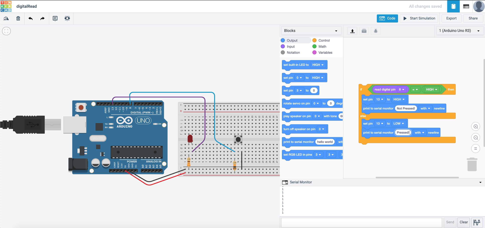

This will happen after you start simulation:

Copy this circuit over to your SSTuino board setup.

>**NOTE:** To prevent damage to your computer or the components, please **do not connect the SSTuino II to your LD or any power supply** when you are wiring up your circuit! Please connect the SSTuino to your LD only after you have finished assembling the circuit.

* Let's share your work! Record and post a video onto Instagram and place a hashtag `#sstuino`! 

We are going to mimic an emergency vehicle (Fire truck, Ambulance, Police cars, etc.) by making 2 LEDs flash individually.
<p align="center">
  <video width="100%" autoplay muted loop controls>
    <source src="https://raw.githubusercontent.com/FourierIndustries-LLP/Knowledge-Base/main/docs/SSTuinoII/tutorials/sec1/digital/assets/arduinoButton12.mp4" type="video/mp4">
  Your browser does not support the video tag.
  </video>
</p>
Set up your circuit as shown:

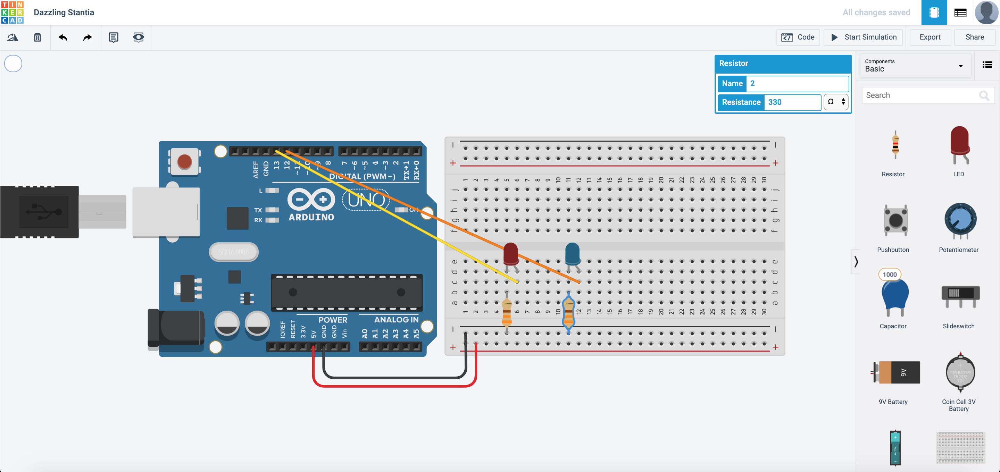

This is one of the ways to program it. What are the other possible ways to program it?


After you are done with the assembly and programming, this is how it should look like:
<p align="center">
  <video width="100%" autoplay muted loop controls>
    <source src="https://raw.githubusercontent.com/FourierIndustries-LLP/Knowledge-Base/main/docs/SSTuinoII/tutorials/sec1/digital/assets/arduinoButton8.mp4" type="video/mp4">
  Your browser does not support the video tag.
  </video>
</p>
Copy this circuit over to your SSTuino board setup.

>**NOTE:** To prevent damage to your computer or the components, please **do not connect the SSTuino II to your LD or any power supply** when you are wiring up your circuit! Please connect the SSTuino to your LD only after you have finished assembling the circuit.
<p align="center">
  <video width="100%" autoplay muted loop controls>
    <source src="https://raw.githubusercontent.com/FourierIndustries-LLP/Knowledge-Base/main/docs/SSTuinoII/tutorials/sec1/digital/assets/arduinoButton13.mp4" type="video/mp4">
  Your browser does not support the video tag.
  </video>
</p>
Now, we are going to improve this circuit by adding a button. This allows the user to turn on the flashing lights only when required. When the button is pressed, the lights will start flashing.

Set up your circuit as shown:

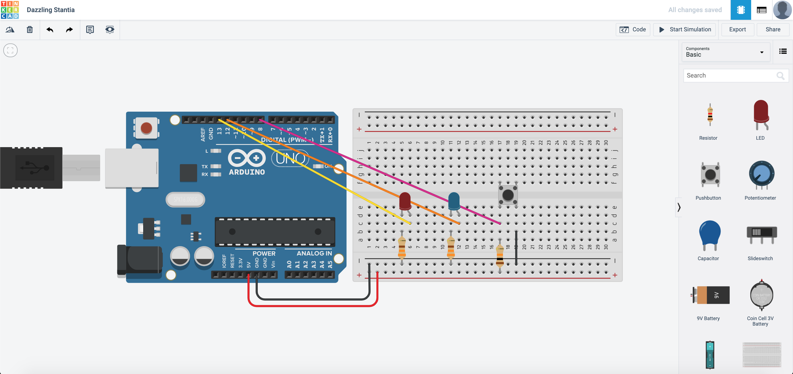

How would you edit the code to make it flash when the button is pressed, and to stop flashing once the button is not pressed?
<p align="center">
  <video width="100%" autoplay muted loop controls>
    <source src="https://raw.githubusercontent.com/FourierIndustries-LLP/Knowledge-Base/main/docs/SSTuinoII/tutorials/sec1/digital/assets/arduinoButton11.mp4" type="video/mp4">
  Your browser does not support the video tag.
  </video>
</p>
How would you edit the code for the lights to flash faster?

Copy this circuit over to your SSTuino board setup.

>**NOTE:** To prevent damage to your computer or the components, please **do not connect the SSTuino II to your LD or any power supply** when you are wiring up your circuit! Please connect the SSTuino to your LD only after you have finished assembling the circuit.
<p align="center">
  <video width="100%" autoplay muted loop controls>
    <source src="https://raw.githubusercontent.com/FourierIndustries-LLP/Knowledge-Base/main/docs/SSTuinoII/tutorials/sec1/digital/assets/arduinoButton14.mp4" type="video/mp4">
  Your browser does not support the video tag.
  </video>
</p>
Let's share your work! Record and post a video onto Instagram and place a hashtag `#sstuino`!

## Emergency vehicle coming through!

With your lights and the push button, let us attempt to insert the siren (**WEE WOO WEE WOO**)! For this section, we are going to use the included buzzer to make some sound!

Duplicate the previous circuit:

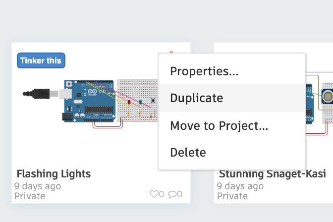

and set it up as follows:

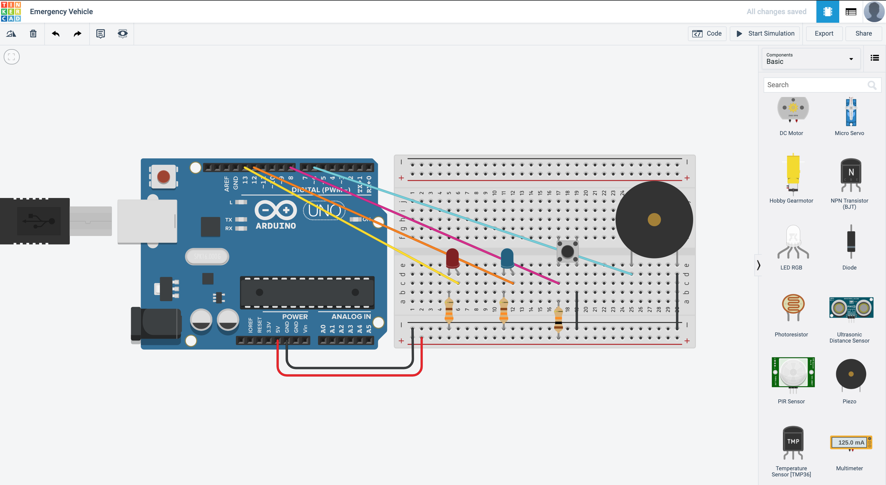

Along with the flashing lights, we would need to program the buzzer such that it sounds correctly! This is one way to program it:


## Naming your variables

After some tinkering with your coding, you may realise that it may be a hassle to change for example a pin, like this example code:

```cpp
void setup()
{
  pinMode(13, OUTPUT);
}

void loop()
{
  digitalWrite(13, HIGH);
  delay(1000); // Wait for 1000 millisecond(s)
  digitalWrite(13, LOW);
  delay(1000); // Wait for 1000 millisecond(s)
}
```

Imagine that you would have to change all the `pin 13` to another pin, and would have to scan through the entire code just to change all these values! Although Arduino code may be rather short, but still... *changing all the numbers like that is kind of a hassle right?*

*Introducing... Variable names. **Imitates Chef's Kiss***

Here is a modified version of the code above.

```cpp
int LED = 13;
int wait = 1000;

void setup()
{
  pinMode(LED, OUTPUT);
}

void loop()
{
  digitalWrite(LED, HIGH);
  delay(wait); // Wait for 1000 millisecond(s)
  digitalWrite(13, LOW);
  delay(wait); // Wait for 1000 millisecond(s)
}
```

***Voilà!*** I have managed to change all the numbers to variable names. For example, in the event I want to adjust the `delay()` function in the code, I just have to change the `1000` at the `int wait=1000;` into a different number! Isn't that way more straightforward?

*How about you try it out?*

## Logic Operations

We are going to introduce the AND OR operators into the program.

### Some History

Back when technology was not this advanced, the various operators were actual hardware logic gates that were placed into the circuit. The chips looked something like this:


In this section, we are going to cover two types of operators

### AND Operator

How it works is that if both Input 1 and Input 2 are `high`, it will give a `high` output, as illustrated in this table:

|Input 1|Input 2|Output|
|0|0|0|
|1|0|0|
|0|1|0|
|1|1|1|

### OR Operator

How it works is that if either Input 1 **OR** Input 2 are `high`, it will give a `high` output. If both Inputs are `high`, it will also give a `high` output, as illustrated in this table:

|Input 1|Input 2|Output|
|0|0|0|
|1|0|1|
|0|1|1|
|1|1|1|

As technology has advanced leaps and bounds, these basic operators evolved from actual hardware gates to just a line of code in your program. A modern microprocessor can do so much more than what these chips used to do.

If you are interested to learn about logic gates:[https://www.electronics-tutorials.ws/logic/logic_10.html](https://www.electronics-tutorials.ws/logic/logic_10.html)

## OR Operator example

Let us create a new circuit in TinkerCAD like this:


Next, we will need to edit the code such that the LED would light up once **one** of the buttons is pressed:

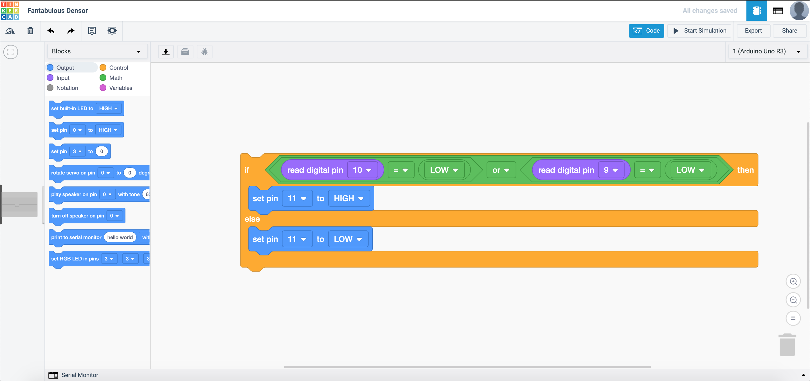

## AND Operator example

For this, we just have to change the code to this:

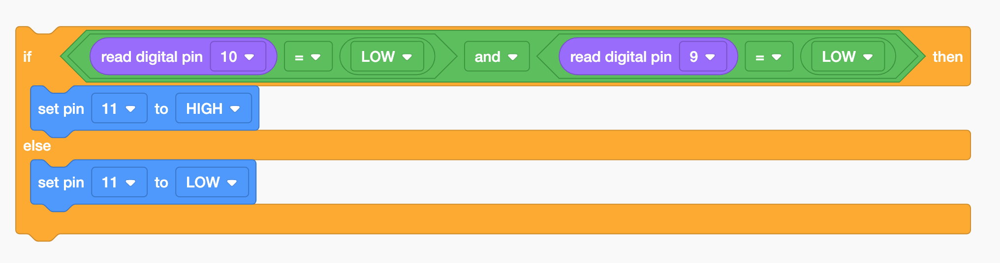

Now start the simulation.

>To activate the two buttons, you would have to press and hold **SHIFT** on your keyboard while clicking the buttons to activate both buttons.

## Putting them together

Let us duplicate the circuit we have just created in the previous section.

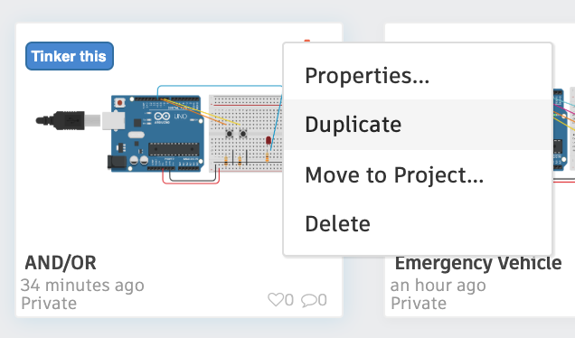

We will need to have 3 LEDs this time, to show that:

|**Button 1**|**Button 2**|**Output**|
|Not Pressed|Not Pressed|RED LED|
|Pressed|Not Pressed|YELLOW LED|
|Not Pressed|Pressed|YELLOW LED|
|Pressed|Pressed|GREEN LED|

The circuit is built as shown:

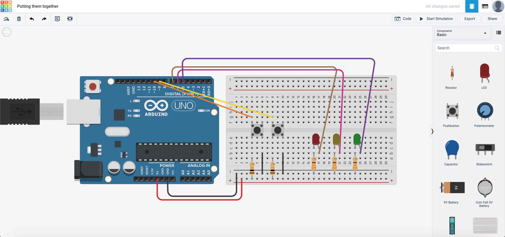

How would you program it?

This is one of the ways it would work:


Here is my thought process:

1. Are any of the buttons pressed? If yes go to 2, if not, Red LED.
2. Are both of the buttons pressed? If yes, Green LED, if not, Yellow LED.

So would there be other ways to do it? *Certainly!* This is just one of the ways you can do it! There are many ways to make it work the same way also!

## Toggle switch

Let us assume that we only have a button to control our lighting. Based on previous examples, if you were want to light up the LED, you would have to press and hold the LED right? What if I was to use the washroom and want the lights to be on? I would then have to press and hold the button for the lights to remain on! To prevent this from happening, we can make our button into a toggle switch with some coding...

Duplicate this circuit from this **[tutorial](#control-your-lights)**

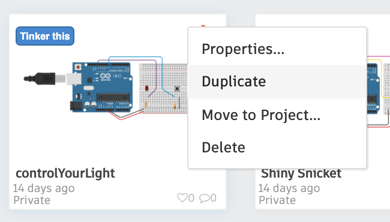

The circuit should look something like this:

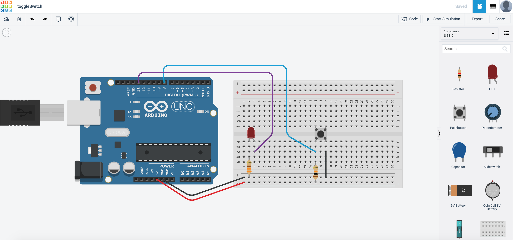

For the program, we would have to introduce variables. To create variables, navigate here:

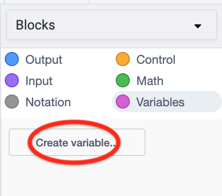

Create the variables `btn` and `led`. We are going to use these variables to store the state of the button and LED. What this means is that if the button is pressed, I change the state of the variable, and it will remember the state. This also means that if I press and hold the button, it does not spam the ON command. It will just activate once. Same with the LED.

Here is how the program can be coded:


Did you manage to do it? If you did, that's great! Let's share your work! Record and post a video onto Instagram and place a hashtag `#sstuino`!

For those who were successful in completing this example, do help your peers out too!
