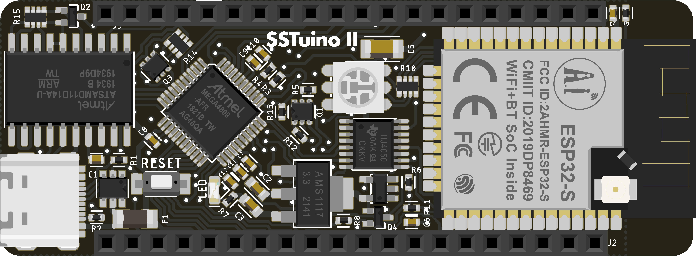
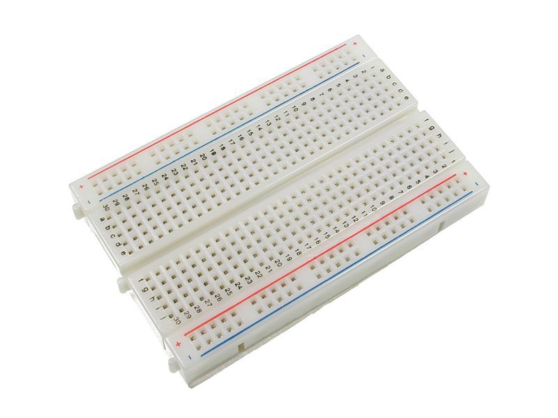

# Basic circuit theory and electronics

{: .no_toc }

  

    Table of contents
  

  {: .text-delta }
1. TOC
{:toc}

> **Note:** As we will be progressing towards tinkering and creating a circuit, a very important rule of thumb is to **not connect the circuit/project to power** before completing it. This helps to lower the risk of a component failing due to a improperly constructed circuit.

## How does circuits work?

A basic electrical circuit has 3 items:

1. Power Source (Battery, Wall Plug, etc.)
2. Wires/Conductors
3. Consumer (e.g. Light bulb, Speaker, Servo, etc.)

The power source provides the electrical energy required by the consumer by travelling through the wires. For example, the battery in this circuit provides energy to the LED.

To prevent too much energy from travelling through the circuit to the consumer, we "limit" it by using resistors. Now we go into Ohm's Law.

## Ohms Law

In a basic circuit, there are 3 variables we need to consider:

1. Voltage
2. Current
3. Resistance

Voltage is the potential difference measured across the component. For example, the potential difference measured across this AA battery is 1.5V. Unit is V.

Current is the rate of which the electricity flows throughout the circuit and is measured in Amperes. Unit is A.

The resistance resists the flow of electricity, to prevent the consumer from being damaged due to too much current flowing through it. Here are 2 examples, the one with resistor to the left, the one without on the right.

To keep it simple for learning, we have 2 main resistors provided in the SSTuino Innovator's Kit v2 that would be just nice for the other components provided.

### Some simple circuit theory...

Let us assume that we have some LEDs, resistors and a power source. Without any knowledge about datasheets and calculation, how should we go about connecting them together?

  

It is that simple.

Moreover, a good resistor value for LEDs is 330Ohms (can be more or less), so we can simply use this resistor. *Easy, right?*

## What does the components in my kit do?

We have included very cool components inside this kit for you to try out and integrate into your projects! Here are the brief functions of them:

### SSTuino II

The SSTuino II is the main microcontroller (or brain) for the kit. It has a Wi-Fi chip on it for use with the Internet of Things (IoT). It has a small footprint to easily integrate the board into projects.

### SSTuino II Explorer Board

The SSTuino II Explorer Board adapts the SSTuino II to a more familiar Arduino Uno form factor. It also includes LEDs to help visualise the usage of the pinouts.

### USB-C Cable

The USB-C Cable connects the SSTuino II to your Learning Device. It is also used to upload code from the Arduino IDE to the SSTuino II.

### Breadboard

The breadboard is very simple to use for you to set up and test your circuits! In your lessons, your teacher will teach you how to connect up the circuits on the breadboard. You will also be using circuit simulation to test out your circuit virtually before implementing it! *So fingers crossed, no magic smoke!*

  

Here is the layout of the breadboard:

  
   

### Dupont Cables (Wires)

The wires are one of the most essential components of the circuit! Without them, the electricity would not flow and the circuit would not work. In the kit, we have provided 2 types of wires; Male - Male, and Male - Female. These would help you to connect to all the components in the kit.

  
   

Male - Male wires on the left, Male - Female wires on the right.
{: .text-center }

### Bag of LEDs

LEDs are great for almost everything! It is a very good source of light while also being very energy efficient. LEDs are found in a large variety of everyday items - Mobile phones, headlamps of a car, flashlights and interior lights to name a few.

  

### Buzzer

A component that emits sound. Able to change pitch too.

### Push Button

A simple switch where circuit is closed when pressed.

### Potentiometer (10K Ohm)

An adjustable resistor with a knob. Max resistance: 10K Ohm.

### Light Dependent Resistor

A resistor that changes resistance due to light intensity.

### TMP36 Temperature Sensor

A small and simple to use temperature sensor.

### Ultrasonic Sensor

Measures distance by using ultrasonic waves. Used on cars too.

### PIR Proximity Sensor

Also known as "motion sensors".

### Servo

A small adjustable motor that rotates 180 degrees.

### RGB LED

LEDs with Red, Green, Blue in one "bulb". Very nice :)

### 330Ohm and 10KOhm resistor reel

Fixed value resistors for circuits.

## What if I need more components?

Content coming soon... :)

## Let us put it into practice!

Next, we will be simulating what we had learnt in this tutorial. We use TinkerCAD as the simulation platform for the SSTuino Innovator's Kit v2.

[Circuit Simulation](page3.md)
