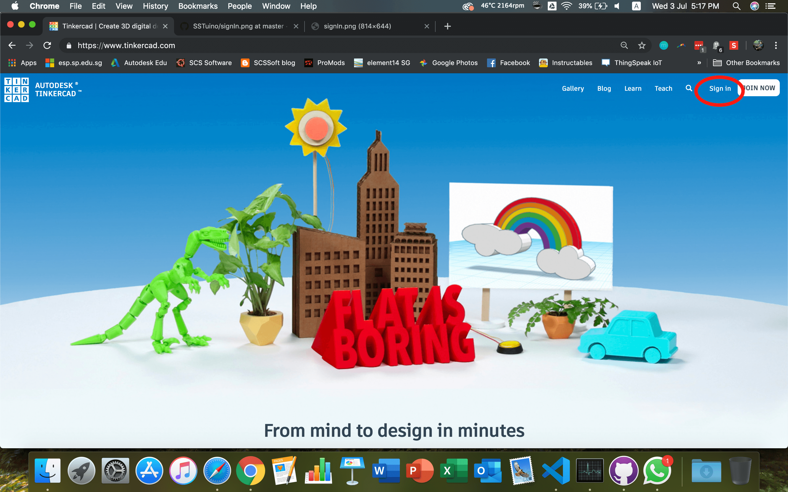
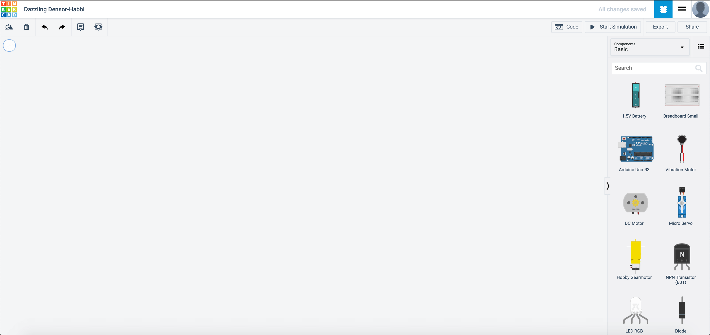
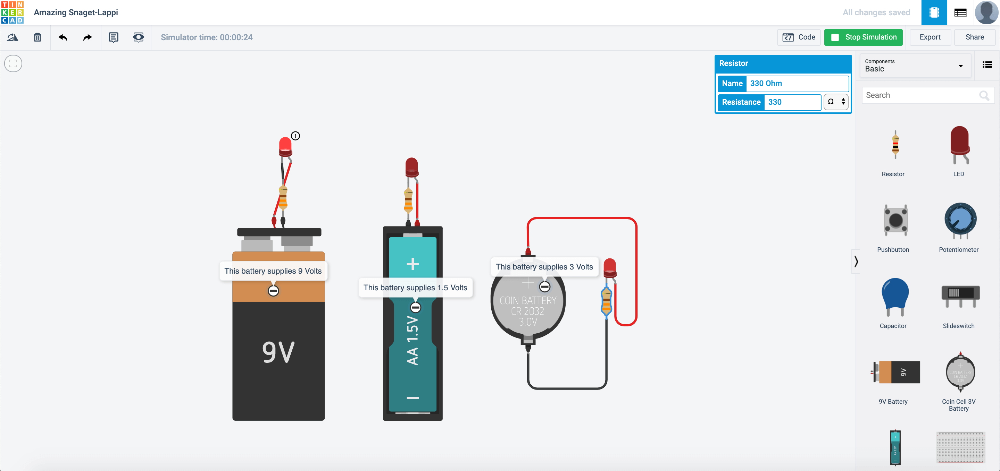
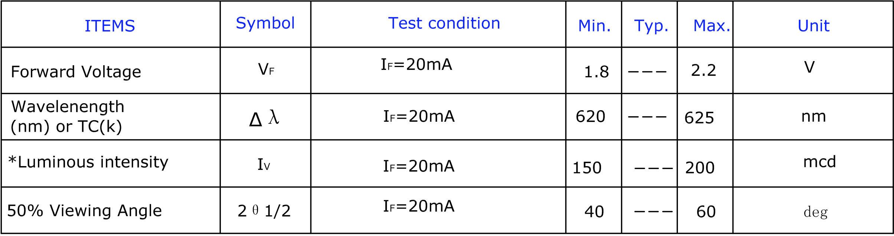
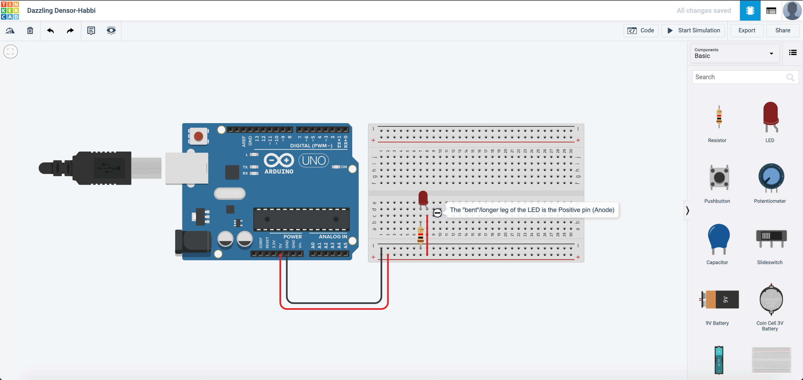
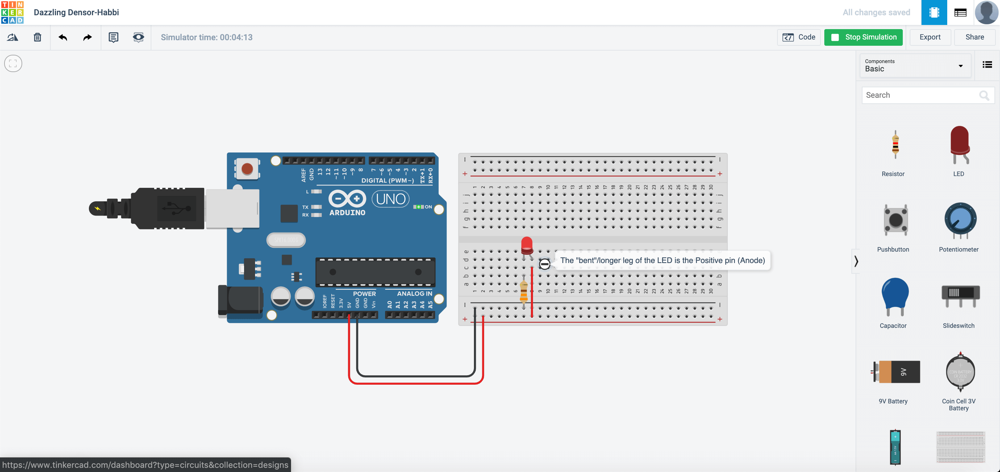
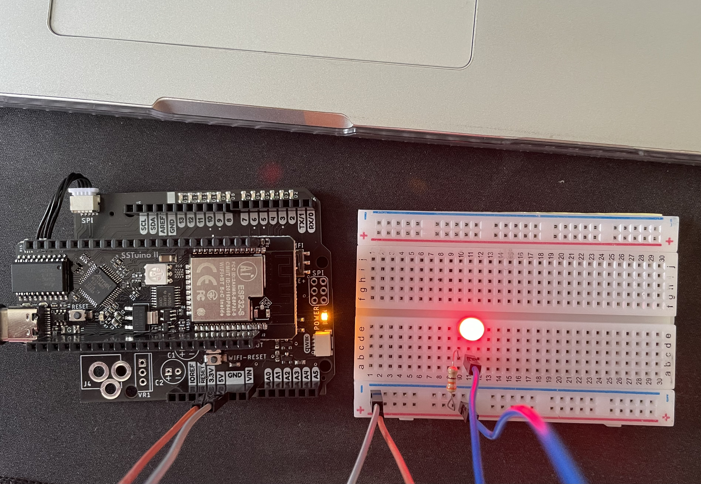
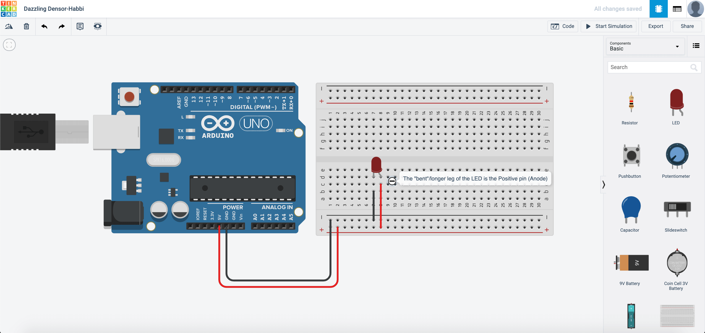
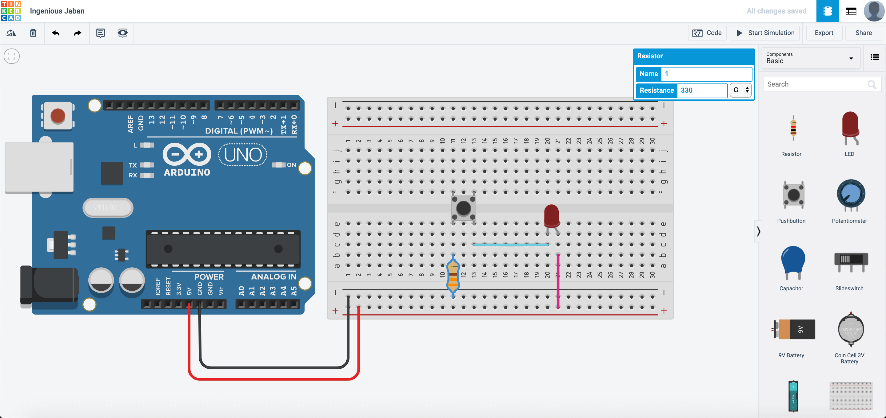
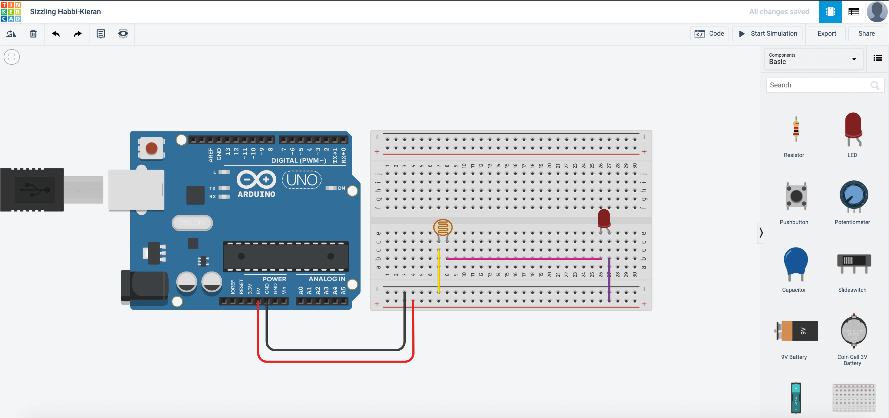

# Circuit Simulation

{: .no_toc }

  

    Table of contents
  

  {: .text-delta }
1. TOC
{:toc}

> **Note:** As we will be progressing towards tinkering and creating circuits, a very important rule of thumb is to **not connect the circuit/project to power** before completing it. This helps to lower the risk of a component failing due to an improperly constructed circuit.

## What is Circuit Simulation?

Circuit Simulation is a great tool to test out your circuit design before assembling it in real life. This helps to reduce the possibility of your components being spoilt due to an incorrect circuit design.  The platform we will be using for the SSTuino Innovator's Kit v2 is TinkerCAD.

## TinkerCAD

Say you have an amazing idea at hand and would like to realise it, to which you are thinking: "Hmm, how can I evolve my idea into a real product?"

Meet TinkerCAD, one of the most popular classroom tools for creating simple designs from scratch. It is a simple to use online 3D design and prototyping program.

Let us set up TinkerCAD and have fun with a mini project!

## Sign in to TinkerCAD

Signing in to TinkerCAD is very simple!

* Go to [tinkercad.com](https://www.tinkercad.com/) and then click on Sign In

* Go to the login screen

  

* Select sign in using social provider, and select your SST Google Account.

  

## Create a Circuit

There are a lot of functions inside TinkerCAD! However, for the purposes of the SSTuino we are going to use the "Circuits" function. Click on "Circuits" on the sidebar and click on create new circuit.

* **Note:** It is a very good habit to create a new circuit after you have finished your previous tutorial, instead of overwriting the current circuit. This is to help you to be able to reference to previous tutorials done when you need help with your future projects.

After you have created the new circuit, it should look like this:

Here are the essential buttons of building electronic circuits with TinkerCAD.

Let us bring out a 9V battery then connect it as follows.

After you have connected the circuit, click on **Start Simulation** on the top right-hand corner of the website.

Once it lights up, the LED burns itself.

The LED burns as there is no resistor used to limit the flow of the current.

Instead, connect a resistor like this:

With the resistor attached, the LED lights up without burning up. :) Try this with different resistor values. What kind of changes happen?

Now, let us try this out using different types of batteries. TinkerCAD mainly provides 3 types of batteries: 9V, 3V and 1.5V. Connect your circuit up as shown.

After you connect up the circuit, this happens:

Why would this happen? This is because that LEDs have a minimum voltage to light up. If you look at the spec sheet located here:

> Forward Voltage: Min 1.8V, Max 2.2V.

This means that the 1.5V battery would be barely able to light up the circuit, and only the 2 other battery types will be able to light up the LED.

## Building a Circuit on the SSTuino II

So you have built yourself some very simple circuits. Now let us build circuits, but with the SSTuino!

In TinkerCAD, create a new circuit. In this new circuit, drag out an Arduino Uno, a breadboard, one resistor and a LED. Connect it in this manner, with the **Positive(+)** connect to **5V** and the **Negative(-)** connect to **GND**. 

Press **Start Simulation** and see your circuit light up!

Now, copy your circuit from TinkerCAD onto your SSTuino Innovator's Kit. 

>**NOTE:** To prevent damage to your computer or the components, please **do not connect the SSTuino II to your LD or any power supply** when you are wiring up your circuit!

It should look something like this:

Let us go back to the simulation and change the circuit like this:

What would happen and why?

## Add a button

Now time for you to "control" your circuit. Set up your circuit like this:

What this circuit allows you to do is to turn on and off your LED. This push button works something like this: When you press the button, the circuit is closed and current can flow to the LED, which makes the LED light up. When the button is not pressed, the circuit is considered open and current will not flow to the LED, which makes the LED not light up.

Copy this circuit over to your SSTuino board setup.

>**NOTE:** To prevent damage to your computer or the components, please **do not connect the SSTuino II to your LD or any power supply** when you are wiring up your circuit!

<iframe id="video" width="560" height="315" src="https://github.com/FourierIndustries-LLP/Knowledge-Base/blob/main/docs/SSTuinoII/tutorials/sec1/electronicBasics/assets/sstuinoii2.MOV" frameborder="0" allow="autoplay; encrypted-media" allowfullscreen=""></iframe>

You can consider adding more LEDs to the circuit. How would you add the LEDs to the circuit? What kind of reaction does your circuit have?

## The photoresistor

The photoresistor is a resistor that reacts to light. It changes resistance when the amount of light it detects changes.

Create a new circuit and set up your circuit like this:

What this circuit allows you to see is the difference in LED brightness as you cover the photoresistor or shine a torch on it.

Copy this circuit over to your SSTuino board setup.

>**NOTE:** To prevent damage to your computer or the components, please **do not connect the SSTuino II to your LD or any power supply** when you are wiring up your circuit!

What happens to the LED brightness as you play with the photoresistor? Record and post a video onto Instagram and place a hashtag `#sstuino`!

## Basic Arduino Programming

Let us learn how to program the SSTuino II with the help of TinkerCAD!

[Programming the SSTuino II](../digital)
