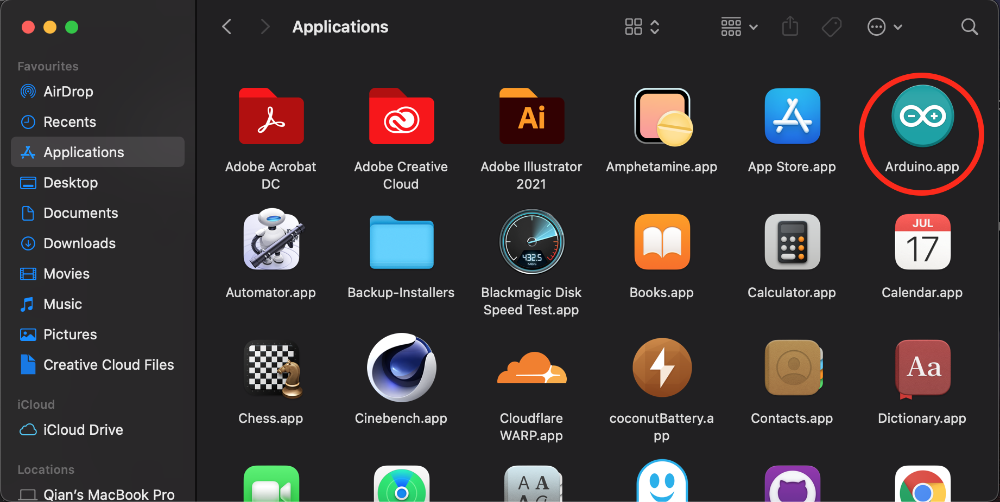
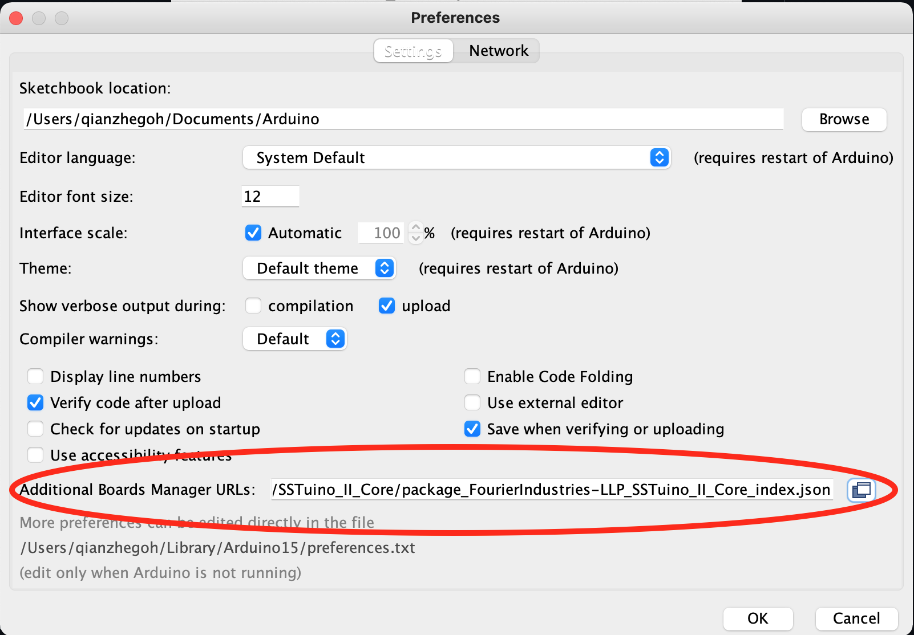
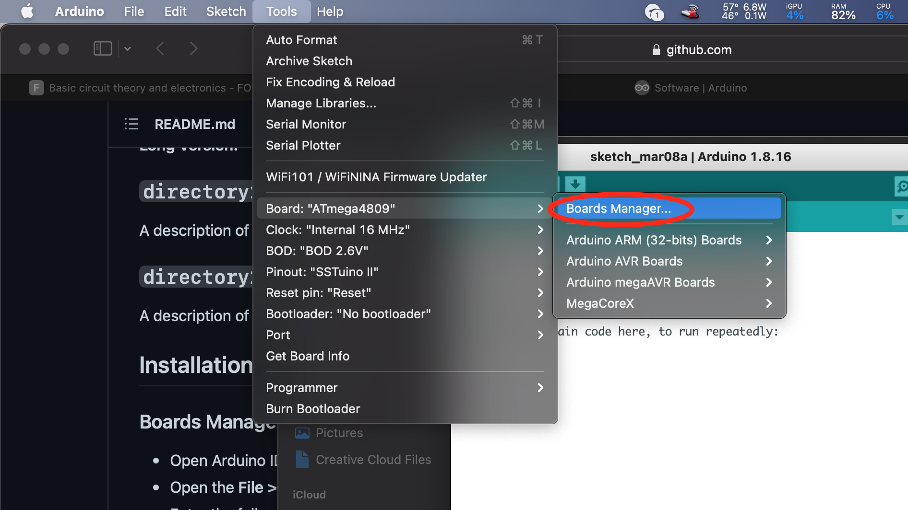
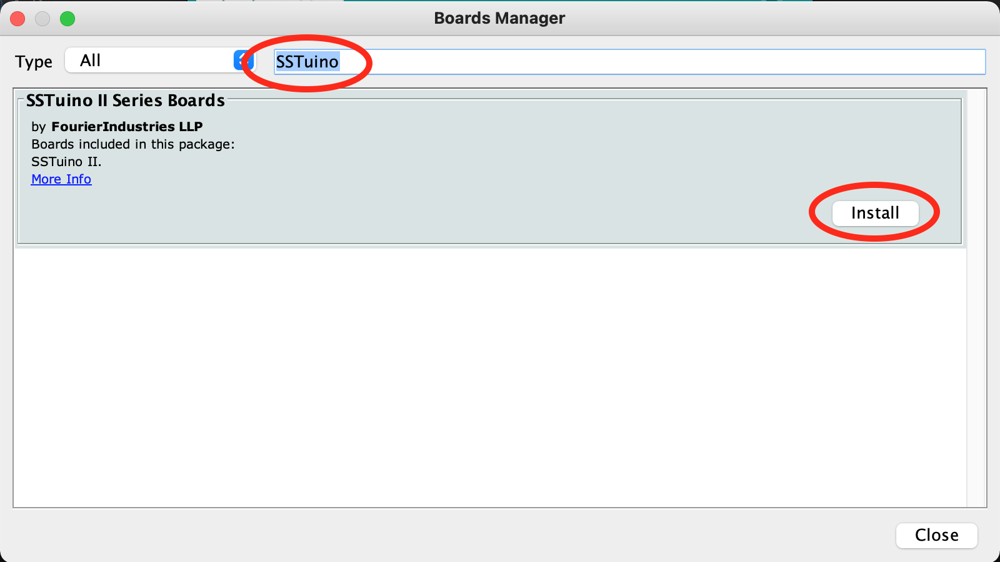

# Setting up your SSTuino II

{: .no_toc }

  

    Table of contents
  

  {: .text-delta }
1. TOC
{:toc}

> **Note:** Please do not plug in the SSTuino II and/or its components to your learning device or any power source first. We will get to it very soon. :)

In this tutorial, we will install the required software, boards and libraries. This allows all of your code that you will create in the future to be transferred onto the SSTuino II.

The SSTuino II has numerous changes as compared to the SSTuino Classic. In the SSTuino II, we have simplified the installation process, for you to get started in no time! :smile:

## Download Arduino IDE

First, let us download the required software for your learning device. Head to [arduino.cc](https://www.arduino.cc) and click on software.

Select the Mac OS X version of the Arduino IDE.

Once the app has been downloaded, install inside your Applications folder.

Once you launch the app, you might see this pop-up. Click on open.

> For apps which are not able to install due to parental controls, please ask your parent to authorise the installation.

## Install required libraries

First, let us go to the preferences of the Arduino app.

Next, copy this line:

'https://fourierindustries-llp.github.io/SSTuino_II_Core/package_FourierIndustries-LLP_SSTuino_II_Core_index.json'

Paste it into the box circled. Click 'OK' after that.

Next, go to 'Tools > Board > Board Manager'

Type in SSTuino into the search bar and click on install.

## All done!

Ok and that sums up the installation process for the SSTuino II for your learning device. Next, let us get to know more about the SSTuino II!

[SSTuino II and the basics of Electronics](../sec1/electronicBasics/index.md)