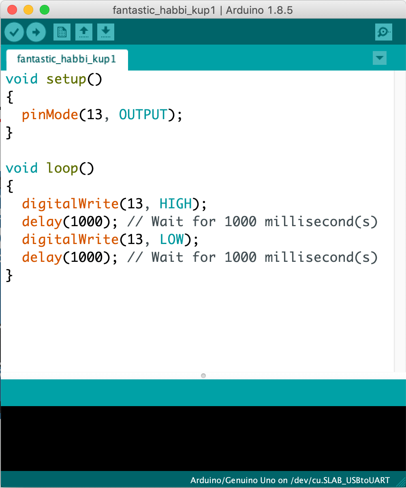
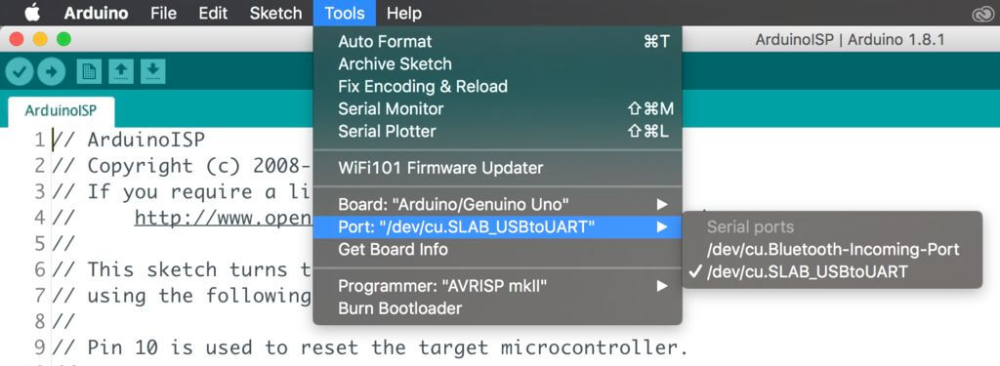
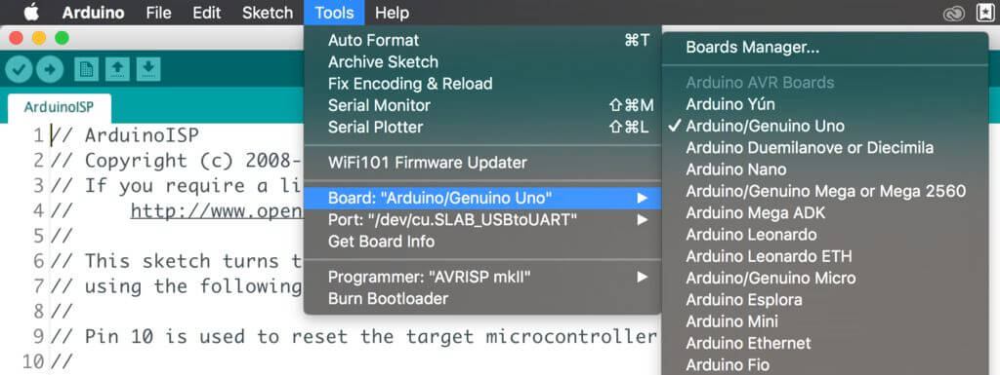
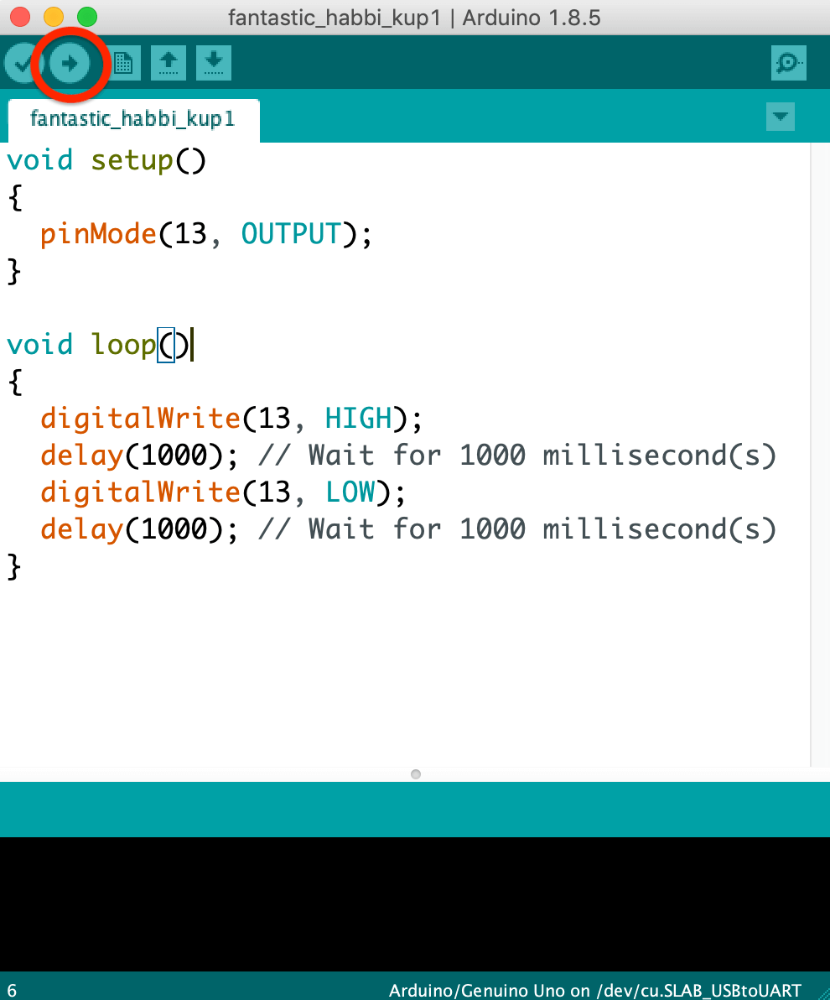

# How does the code work?

{: .no_toc }

<details open markdown="block">
  <summary>
    Table of contents
  </summary>
  {: .text-delta }
1. TOC
{:toc}
</details>

You would probably have noticed that this code looks rather different than the blocks you see in TinkerCAD. The Arduino app that you are using right now is called an **Integrated Development Environment** or **IDE** for short and is one of the places that you can program your SSTuino in.

For example, I use another IDE called Visual Studio Code to modify this website for you! (in [Markdown](https://en.wikipedia.org/wiki/Markdown))


Let us analyse the code we see here



Here is an explanation on how most basic Arduino code works:

``` c++
// These two slashes indicate a comment
/* This also indicates a comment 
The brackets () indicate a function e.g. int main()
*/
void setup() //This is only run once when the device first powers up
{ //<- The curly brackets are very important. Place them carefully to avoid confusion.
    pinMode(13,OUTPUT); 
    /*
    Why is pinMode written as so? That is due to the practice of using camelCase for writing code.
    We declare pin 13 as the output pin. It can also be written as pinMode(LED_BUILTIN, OUTPUT).
    The state "OUTPUT" must be written in CAPITAL LETTERS.
    
    It is also very important to place a semicolon ";" when you finish your "sentence", just like
    your English sentences.
    */
    
}

void loop() //loop = runs forever till the end of time (or until you turn off the power)
{
  digitalWrite(13, HIGH);// Turn on pin 13
  delay(1000); // Wait for 1000 millisecond(s)
  digitalWrite(13, LOW);// Turn off pin 13
  delay(1000); // Wait for 1000 millisecond(s)

  /* 
  The section above will turn on and off the LED. Note the CAPITAL LETTERS on the "HIGH" and "LOW"
  */
}
```

Learn more about camelCase here: [https://en.wikipedia.org/wiki/Camel_case](https://en.wikipedia.org/wiki/Camel_case)

Learn more about the "()" :[http://www.cplusplus.com/reference/functional/function/operator_func/](http://www.cplusplus.com/reference/functional/function/operator_func/)

If you want to read up about C++: [http://www.cplusplus.com/](http://www.cplusplus.com/)

Arduino language reference: [https://www.arduino.cc/reference/en/](https://www.arduino.cc/reference/en/)

## It WORKS!!!

Now, let us connect our SSTuino like this:

>**NOTE:** To prevent damage to your computer or the components, please **disconnect all power from the SSTuino board** when you are wiring up your circuit!

Connect the SSTuino to your mac after you have finished assembling the circuit.

In your Arduino IDE, go to

> Tools -> Port -> /dev/tty.SLAB_USBtoUART



Make sure to select the correct board:



And now you can upload with this button:



You should see your circuit light up like this:


## Next Tutorial

[digitalRead/Write](../digitalRead/index.md)