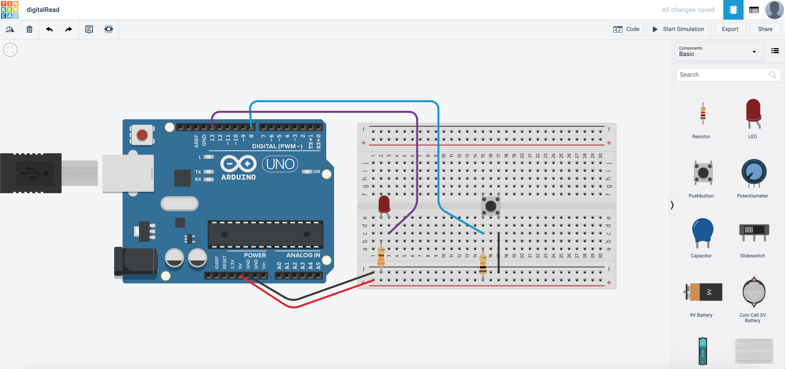

# My SSTuino can read?!

{: .no_toc }

  

    Table of contents
  

  {: .text-delta }
1. TOC
{:toc}

*Well, not literally reading English...* Microcontrollers like the SSTuino and the Arduino can read data from a large variety of channels, such as sensor data, internet data, and so on.

## Pull-up Resistors

Pull-up resistors are found in digital logic devices and microcontrollers. When a pin in say, the SSTuino is connected as an input and tries to read the state of the pin, it is very difficult to determine wether the pin is actually high or low, due to a lot of factors such as noise in the circuit. This phenomena is referred to as floating (more detailed explanation [here](https://learn.adafruit.com/circuit-playground-digital-input/floating-inputs)).

To eliminate this, we will place a pull-up resistor to ensure that the pin is either in its `high` or `low` state, while using a litle bit of current. Pull-up resistors are usually used on buttons and switches where there is a possibility of signal noise.

If you would like to read more about this, visit this sparkfun guide here: 

[https://learn.sparkfun.com/tutorials/pull-up-resistors/all](https://learn.sparkfun.com/tutorials/pull-up-resistors/all)

## Buttons!

We are going to read very simple data from a push button, to know wether it has been pressed or not. Set up your circuit as shown:

Next, go to the coding section and then program it like this:

What this code does is that the Arduino would wait for the button to be pressed. If the button is not pressed, it would output "Not pressed!" in the serial monitor. If the button is pressed, it would output "pressed!" in the serial monitor.

Now start simulation and then press the serial monitor:

Copy this circuit over to your SSTuino board setup.

>**NOTE:** To prevent damage to your computer or the components, please **disconnect all power from the SSTuino board** when you are wiring up your circuit!

## Control your lights!

*This time with coding...* With the data we have read from the push button, we can use it to trigger a reaction! Set up your circuit as shown:

Next, we will need to edit the code such that the LED will light up when the button is pressed:

This will happen after you start simulation:

Copy this circuit over to your SSTuino board setup.

>**NOTE:** To prevent damage to your computer or the components, please **disconnect all power from the SSTuino board** when you are wiring up your circuit!

* Record and post a video onto Instagram and place a hashtag `#sstuino`! 

## Next Chapter
[Flashing Lights](page2.md)