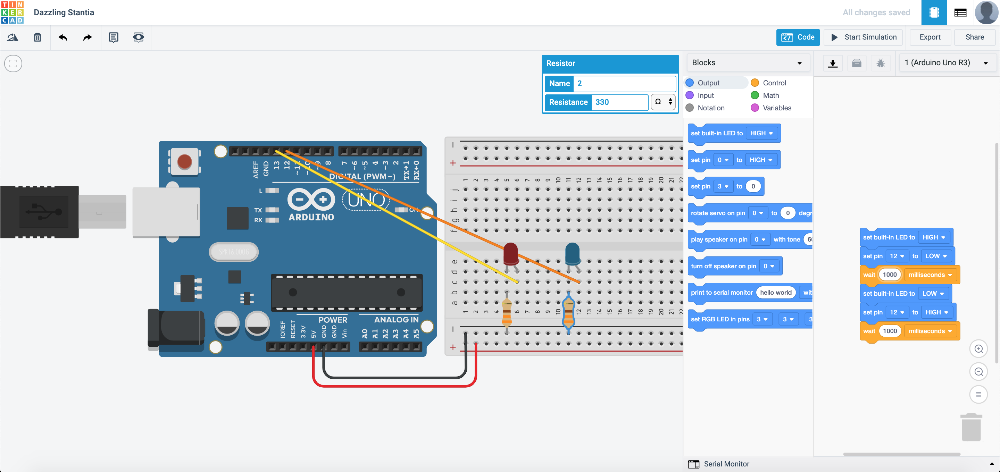
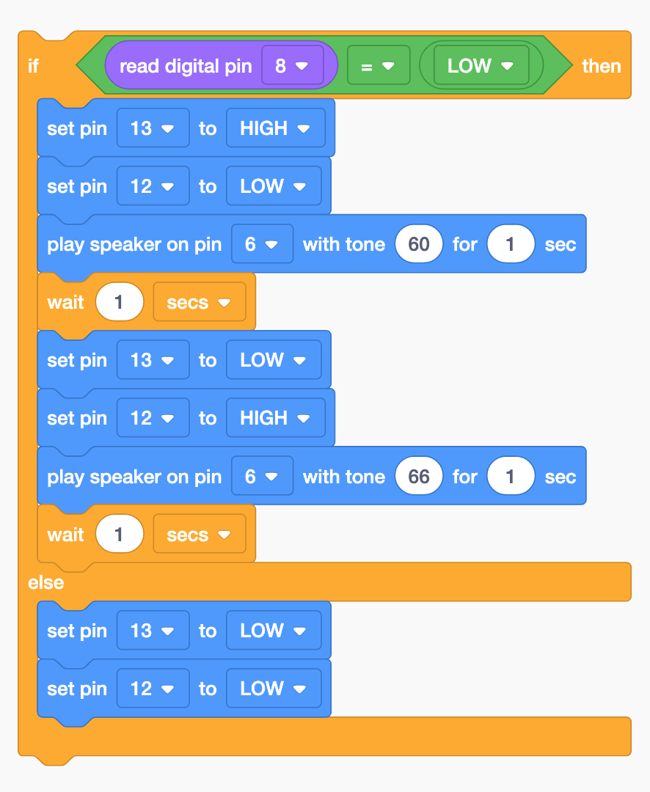

# Flashing Lights!

{: .no_toc }

<details open markdown="block">
  <summary>
    Table of contents
  </summary>
  {: .text-delta }
1. TOC
{:toc}
</details>

 

 We are going to alternate the flashing of 2 different LED lights to mimick that of an emergency vehicle (e.g. Ambluance, Police Car, Fire Brigade etc.)

 Set up your circuit as shown:


 This is one of the ways to program it. What other ways can you program it?



After you are done with the assembly and programming, this is how it should look like:


Copy this circuit over to your SSTuino board setup.

>**NOTE:** To prevent damage to your computer or the components, please **disconnect all power from the SSTuino board** when you are wiring up your circuit!


Now, we are going to improve this circuit by adding a button. This allows the user to turn on the flashing lights only when he/she needs to use it. When the button is pressed, the lights will start flashing?

Set up your circuit as shown:


How would you edit the code to make it flash when the button is pressed, and to stop flashing once the button is not pressed?


How would you edit the code for the lights to flash faster?

Copy this circuit over to your SSTuino board setup.

>**NOTE:** To prevent damage to your computer or the components, please **disconnect all power from the SSTuino board** when you are wiring up your circuit!


Record and post a video onto Instagram and place a hashtag `#sstuino`! 

## Emergency vehicle coming through!

With your lights and the push button, let us attempt to insert some sound! For this section, we are going to use the included buzzer to make some sound!

Duplicate the previous circuit:


and set it up as follows:


Along with the flashing lights, we would need to program the buzzer such that it sounds correctly! This is one way to program it:



## Naming your variables

After some tinkering with your coding, you may realise that it may be an hassle to change for example a pin, like this example code:

```C++
void setup()
{
  pinMode(13, OUTPUT);
}

void loop()
{
  digitalWrite(13, HIGH);
  delay(1000); // Wait for 1000 millisecond(s)
  digitalWrite(13, LOW);
  delay(1000); // Wait for 1000 millisecond(s)
}
```

Imagine that you would have to change all the `pin 13` to another pin, and would have to scan through the entire code just to change all these values! Although Arduino Programs may be rather short, but still... *changing all of the numbers like that is kind of a hassle right?*

*Introducing... Variable names.* 

Here is a modified version of the code you saw above just now.

```C++
int LED = 13;
int wait = 1000;

void setup()
{
  pinMode(LED, OUTPUT);
}

void loop()
{
  digitalWrite(LED, HIGH);
  delay(wait); // Wait for 1000 millisecond(s)
  digitalWrite(13, LOW);
  delay(wait); // Wait for 1000 millisecond(s)
}
```

**SEE?** I have managed to change all the numbers to variable names. For example, in the event I want to adjust the `delay()` function in the code, I just have to change the `1000` at the `int wait=1000;` into a different number! Isn't that way more straightforward?

*How about you try it out?*

## Next Chapter
[Logic Operations](page3.md)