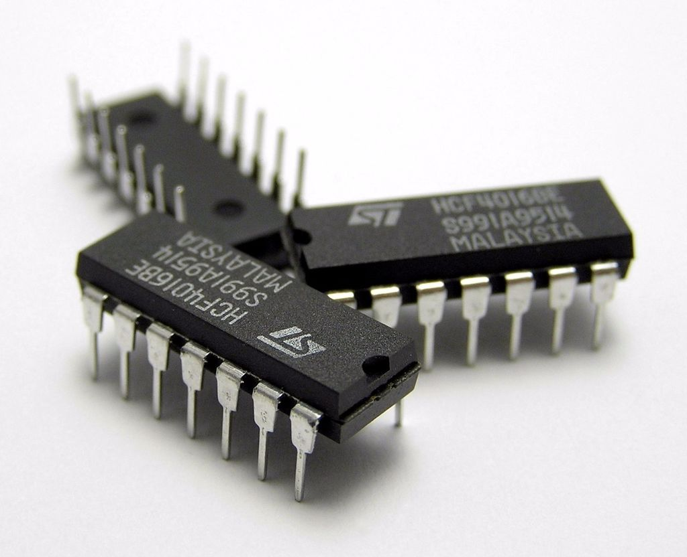
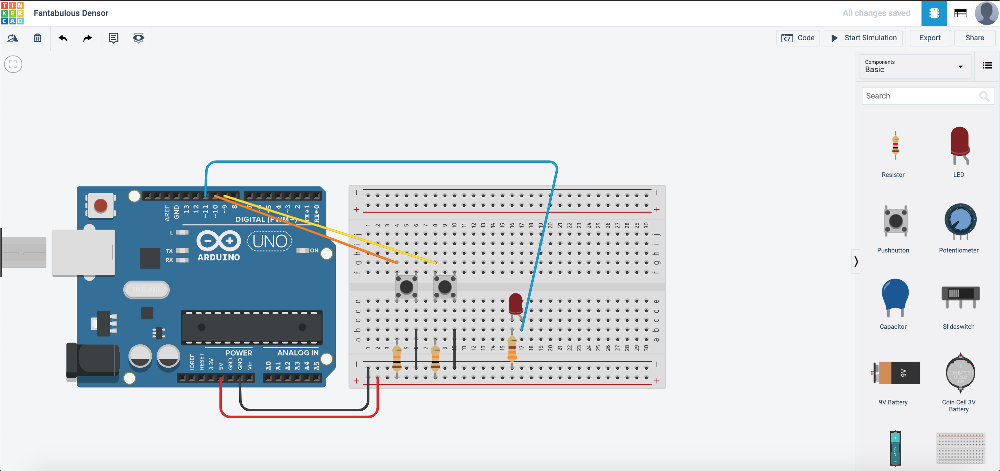
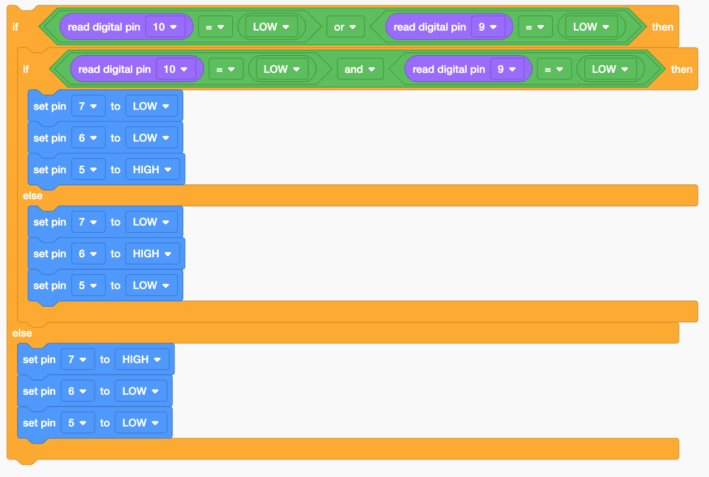
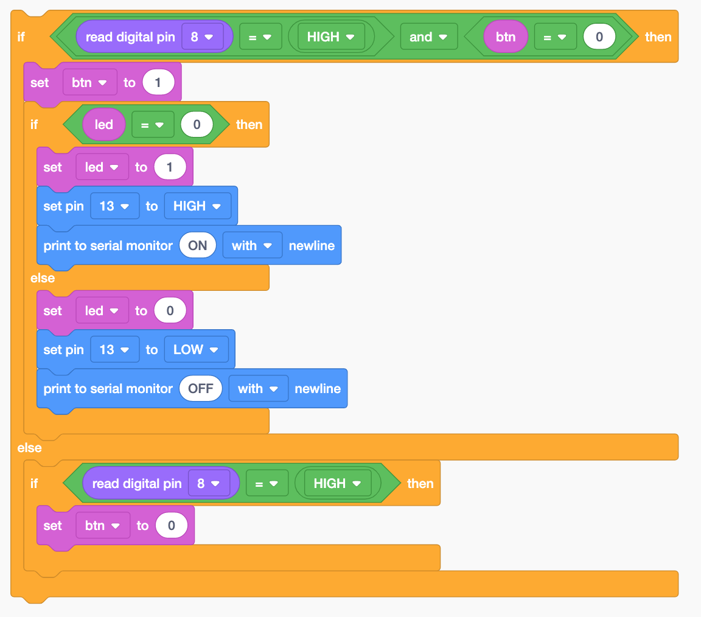

# How about 2 buttons?!

{: .no_toc }

  

    Table of contents
  

  {: .text-delta }
1. TOC
{:toc}

 We are going to introduce the AND OR operators into the program.

### Some History...

Back when technology was not this advanced, the various operators were actual hardware logic gates that were placed into the circuit. The chips looked something like this:

In this section, we are going to cover two types of operators

**AND Operator**

How it works is that if both Input 1 and Input 2 are `high`, it will give a `high` output, as illustrated in this table:

|Input 1|Input 2|Output|
|0|0|0|
|1|0|0|
|0|1|0|
|1|1|1|

**OR Operator**

How it works is that if either Input 1 **OR** Input 2 are `high`, it will give a `high` output. If both Inputs are `high`, it will also give a `high` output, as illustrated in this table:

|Input 1|Input 2|Output|
|0|0|0|
|1|0|1|
|0|1|1|
|1|1|1|

As technology has advanced leaps and bounds, these basic operators evolved from actual hardware gates to just a line of code in your program. A modern microprocessor can do so much more than what these chips used to do.

If you are interested to learn about logic gates:[https://www.electronics-tutorials.ws/logic/logic_10.html](https://www.electronics-tutorials.ws/logic/logic_10.html)

## OR Operator example:

Let us create a new circuit in TinkerCAD like this:

Next, we will need to edit the code such that the LED would light up once **one** of the buttons is pressed:

## AND Operator example:

For this, we just have to change the code to this:

Now start the simulation.

>To activate the two buttons, you would have to press and hold **SHIFT** on your keyboard while clicking the buttons to activate both buttons.

## Putting them together

Let us duplicate the circuit we have just created in the previous section.

We will need to have 3 LEDs this time, to show that:

|**Button 1**|**Button 2**|**Output**|
|Not Pressed|Not Pressed|RED LED|
|Pressed|Not Pressed|YELLOW LED|
|Not Pressed|Pressed|YELLOW LED|
|Pressed|Pressed|GREEN LED|

The circuit is built as shown:

How would you program it?

This is one of the ways it would work:

I would ask:
1. Are any of the buttons pressed? If yes go to 2, if not, Red LED.
2. Are both of the buttons pressed? If yes, Green LED, if not, Yellow LED.

So would there be other ways to do it? *Certainly!* This is just one of the ways you can do it! There are many ways to make it work the same way also!

## Toggle switch

Let us assume that we only have a button to control our lighting. Based on previous examples, if you were want to light up the LED, you would have to press and hold the LED right? What if I was to use the washroom and want the lights to be on? I would then have to press and hold the button for the lights to remain on! To prevent this from happening, we can make our button into a toggle switch with some coding...

Duplicate this circuit from the this **[tutorial](#control-your-lights)**

The circuit should look something like this:

For the program, we would have to introduce variables. To create variables, navigate here:

Create the variables `btn` and `led`. We are going to use these variables to store the state of the button and LED. What this means is that if the button is pressed, I change the state of the variable and it will remember the state, which also means that if I press and hold it, it does not spam the ON command. It will just activate once. Same with the LED.

Here is how the program can be coded:

Did you manage to do it?

## Next Tutorial
[analogRead/Write](../analogRead/index.md)