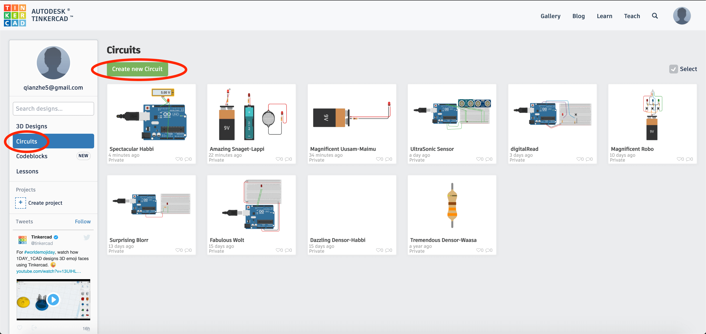
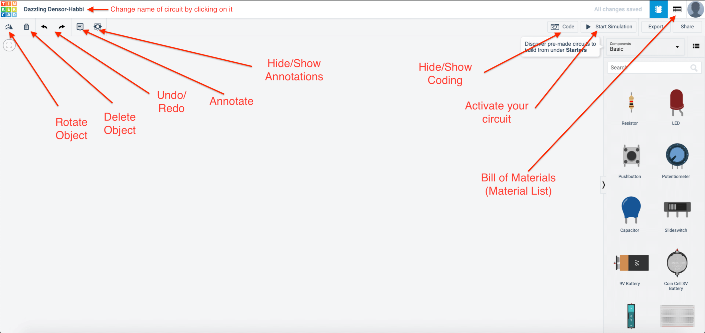
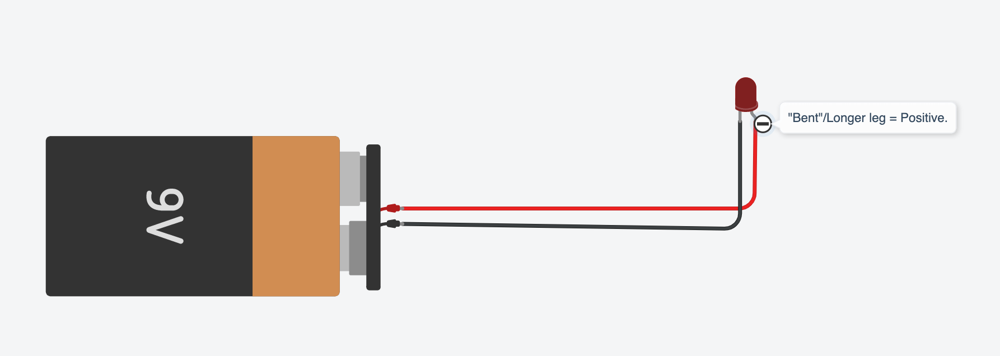
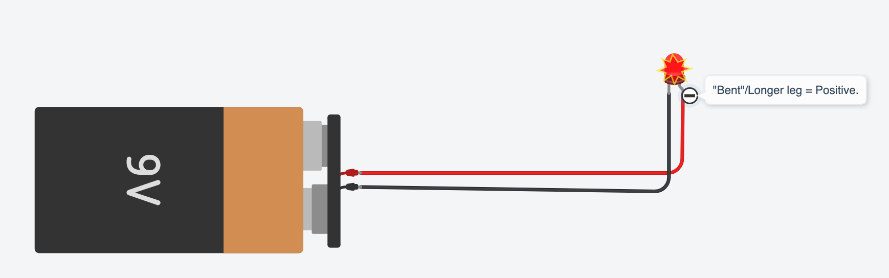
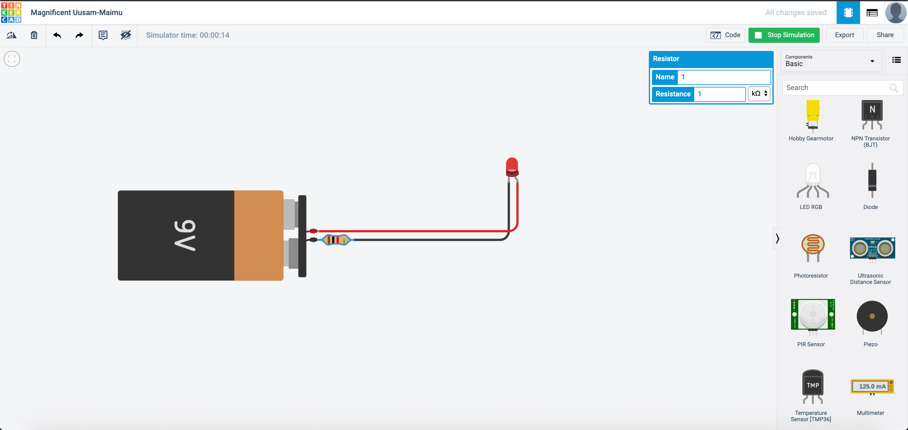
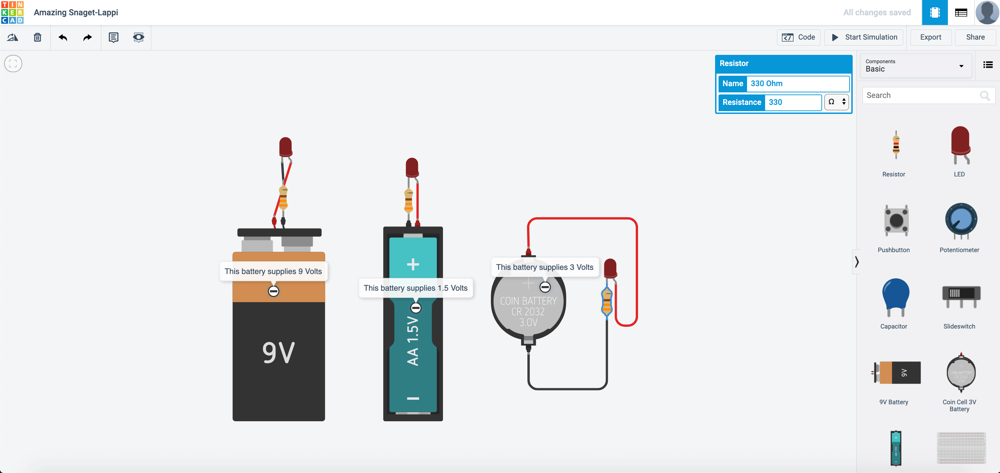

# First TinkerCAD Circuit

{: .no_toc }

  

    Table of contents
  

  {: .text-delta }
1. TOC
{:toc}

Back to the topic of burning LEDs, here is one huge benefit of using TinkerCAD. As TinkerCAD can simulate circuits, we can test whether we use the correct components and connected it correctly before actually building it.

To start building our circuit, after you have logged in to your TinkerCAD account, navigate to 

* Circuits -> Create new Circuit

It is a very good habit to create a new circuit after you have finished your previous tutorial. This is to help you to be able to remember previous tutorials done when you would like to use it next time. After you have created the new circuit, it should look like this:

Here are the essential buttons of building electronic circuits with TinkerCAD.

Let us bring out a 9V battery then connect it as follows.

After you have connected the circuit, click on **Start Simulation** on the top right hand corner of the website.

Once it lights up, this happens.

The reason this happens is due to the incorrect resistor being used. Remember **[Ohm's Law?](https://d3lta-v.github.io/SSTuino/tutorials/Sec1/electronicBasics.html#the-resistor)** When the resistance is too low the current would be too high.

Instead, connect a resistor like this:

With the resistor attached, the LED lights up without burning up. :) Now you try this with different resistor values. What kind of changes happen?

Now, let us try this out using different types of batteries.TinkerCAD mainly provides 3 types of batteries: 9V, 3V and 1.5V. Connect your circuit up as shown.

After you connect up the circuit, this happens:

Why would this happen? This is because that LEDs have a minimum voltage to light up. If you look at the spec sheet located here:

[https://www.sparkfun.com/datasheets/Components/LED/COM-09590-YSL-R531R3D-D2.pdf](https://www.sparkfun.com/datasheets/Components/LED/COM-09590-YSL-R531R3D-D2.pdf)

> Forward Voltage: Min 1.8V, Max 2.2V. Suggested current:16 - 18mA

This means that the 1.5V battery would be barely able to light up the circuit, and only the 2 other battery types will be able to light up.

## Next Chapter
[First SSTuino Circuit](page3.md)