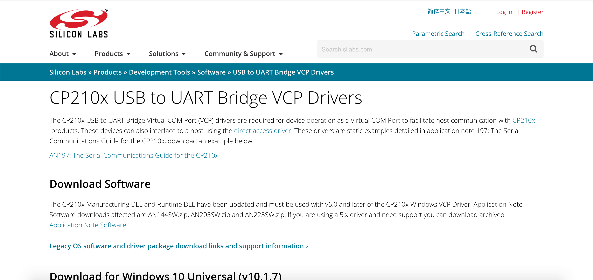
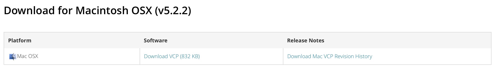
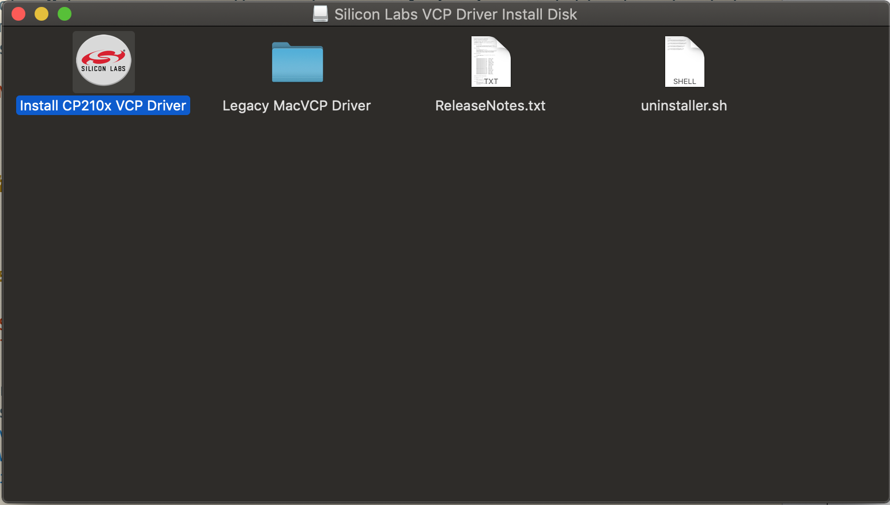
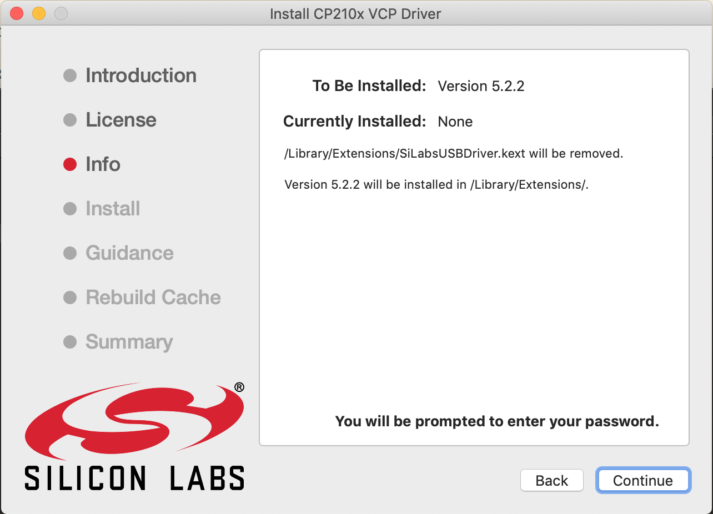

# Installation of CP2102 Driver

{: .no_toc }

  

    Table of contents
  

  {: .text-delta }
1. TOC
{:toc}

We are using the NEU (New Enhanced UART) for our SSTuino. It is our custom made CP2102 USB to serial converter for the computer to "talk" to the SSTuino. To use the NEU with the MacOS, a firmware is reqruied to be installed.

## Installation for MacOS

For MacOS users, the Silicon Labs driver has to be manually downloaded and installed. The driver can be downloaded here: [https://www.silabs.com/products/development-tools/software/usb-to-uart-bridge-vcp-drivers](https://www.silabs.com/products/development-tools/software/usb-to-uart-bridge-vcp-drivers)

Navigate to this area and download the driver. After the driver has been downloaded, launch the `SiLabsUSBDriverDisk.dmg` located inside the folder you have downloaded. You will need to run the `Install CP210x VCP Driver` app, as demonstrated below: 

Follow the instructions from the installation app. Note that you will be prompted to enter your password.

## Next Step
[Installation of Arduino IDE and SSTuino Companion Libaray](page2.md)