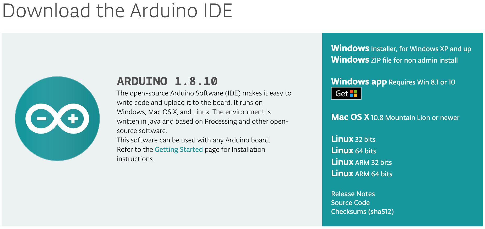

# Installation of the Arduino IDE

{: .no_toc }

<details open markdown="block">
  <summary>
    Table of contents
  </summary>
  {: .text-delta }
1. TOC
{:toc}
</details>



- Go to the the downloads page here: [https://www.arduino.cc/en/Main/Software](https://www.arduino.cc/en/Main/Software)
- Download the version of the application you require.
    - For MacOS users download the Mac OS X version 10.8 Mountain Lion and newer. For MacOS Catalina users, please download the newest version available, as versions before 1.8.10 will not work with MacOS Catalina.

After download of the zip file from the Arduino website, simply copy the .app file into your **Applications** folder. 

>Note: Make sure you copy the app to your **Applications** folder for elevated admistrative rights. Those learning devices with parental controls will have a password prompt for administrative access.


In any event the system asks you whether to open the app, just click open.

## Installation of the SSTuino Companion Library

We have some additional examples that are specially catered for the SSTuino. 

First, we need to install a library to your Arduino IDE. Simply copy and paste this command into your Terminal:

```sh
curl -fsSL https://sstuino.fourier.industries/library_install.sh | bash
```

...and hit enter! The installation should complete without any errors. You can always update your library by running the same command if there is a new release of the library available.

## Ready to roll?

After these two important things are installed, you should be pretty much ready for our further tutorials! If you are ready, proceed on to the next tutorial: [Hello World!](helloWorld.md)