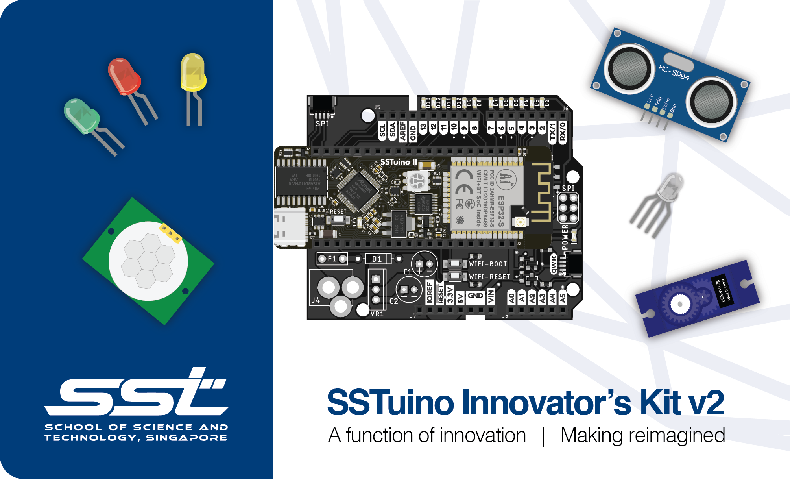
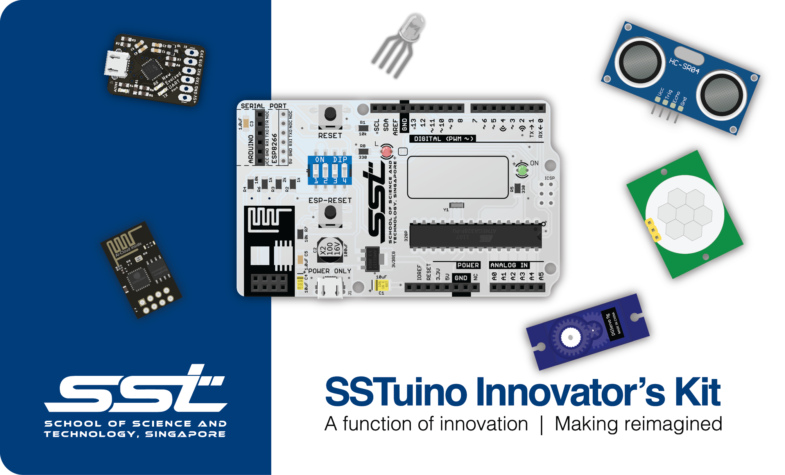

# FourierIndustries Knowledge Base

Hello! Welcome to our Knowledge Base! Which product are you using?

## SSTuino Innovator's Kit v2

The SSTuino II will be used for cirriculums from 2022 onwards. This section of the Knowledge Base is currently under construction. Please visit us soon!

[SSTuino Innovator's Kit v2](SSTuinoII/index.md){: .btn }

## SSTuino Innovator's Kit

The first generation of the SSTuino Innovator's Kit was offered to SST Students from 2018 to 2021. It was an enriching electronics prototyping kit for the students to explore prototyping, electronics and the Internet-of-Things. 

It includes the SSTuino Classic, which was a custom designed Internet-of-Things microcontroller based off the Arduino Uno platform.

[SSTuino Innovator's Kit](SSTuino_Classic/index.md){: .btn }

## Other Products

Other products like the NEU can be found here.

[Other Products](Other_Products/index.md){: .btn }